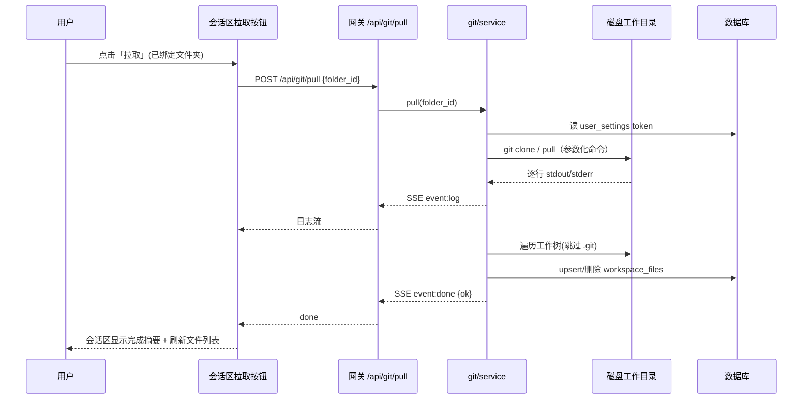
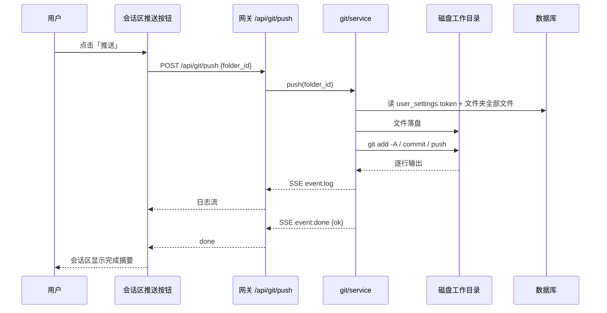
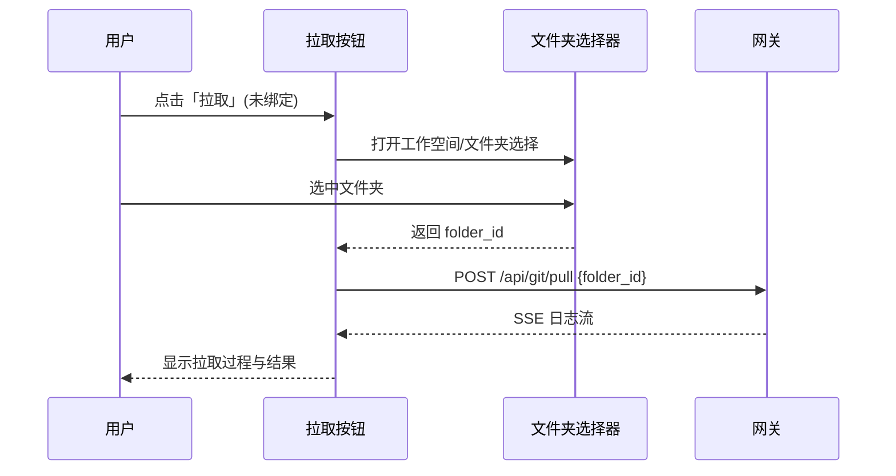

# Git 集成接口文档

> 粒度：L4 ｜ 版本：1.0 ｜ 日期：2026-08-07

## 1. 约定

- 基址：网关 `http://127.0.0.1:8001`；前端经 Next.js `/api/:path*` 代理。
- 鉴权：与平台一致（会话 Cookie / Bearer）；身份一律以 `get_effective_user_id()` 为准。
- CSRF：所有 POST/PUT/DELETE 需 `X-CSRF-Token`（前端 fetcher 自动注入）。
- 错误格式：`{"detail": "..."}`；认证失败/无 Token → 400；仓库不存在 → 404。
- 明文 Token 只入站（PUT 写入），所有 GET 出站均掩码。

## 2. 接口列表

### 2.1 凭证配置

**GET /api/git/config** → 200

```json
{
  "github": { "configured": false },
  "gitee":  { "configured": false }
}
```

- `configured`：该用户是否已配置对应平台 Token。

**PUT /api/git/config** → 200

```json
{ "github_token": "ghp_xxx", "gitee_token": "gitee_xxx" }
```

- 字段可缺省：缺省/空串/`null` → 清除该平台 Token；其余平台不受影响。
- 成功返回 `{ "github": {"configured": true}, "gitee": {"configured": true} }`。

### 2.2 文件夹-仓库绑定

**GET /api/folders/{folder_id}/git** → 200

```json
{
  "folder_id": "...",
  "provider": "github",
  "repo_url": "https://github.com/owner/repo.git",
  "repo_name": "owner/repo",
  "git_updated_at": "2026-08-07T12:00:00Z"
}
```

- 未绑定：`{ "folder_id": "...", "provider": null, "repo_url": null, ... }`。

**PUT /api/folders/{folder_id}/git** → 200

```json
{ "provider": "github", "repo_url": "https://github.com/owner/repo.git" }
```

- 校验：`provider ∈ {github, gitee}`；`repo_url` 必须 `https://` 且以 `.git` 结尾（或规范化补全）；写入时同时推导 `repo_name`（`owner/repo`）。

### 2.3 拉取（SSE）

**POST /api/git/pull** → `text/event-stream`

```json
{ "folder_id": "..." }
```

- 服务端要求：该文件夹已绑定仓库（`git_repo_url` 非空），否则先返回 400。
- 流程：解析 Token（缺 → 400 `git token not configured`）→ `git clone`（工作目录无 `.git`）或 `git pull` → 磁盘→DB 落库 → 结束事件。

SSE 事件格式：

```
event: log
data: {"line": "Cloning into '/mnt/...'..."}

event: done
data: {"ok": true, "message": "拉取成功：5 个文件已更新"}
```

### 2.4 推送（SSE）

**POST /api/git/push** → `text/event-stream`

```json
{ "folder_id": "..." }
```

- 流程：解析 Token → 文件夹 DB 全部文件落盘 → `git add -A` → `git commit`（消息 `[TianShu] update via workspace`）→ `git push` → 结束事件。
- 未绑定仓库/无 Token → 400；推送被远端拒绝 → `done: {ok: false, message: "..."}` 并完整输出日志。

## 3. 时序图

### 3.1 拉取



### 3.2 推送



### 3.3 首次拉取（未绑定文件夹）


