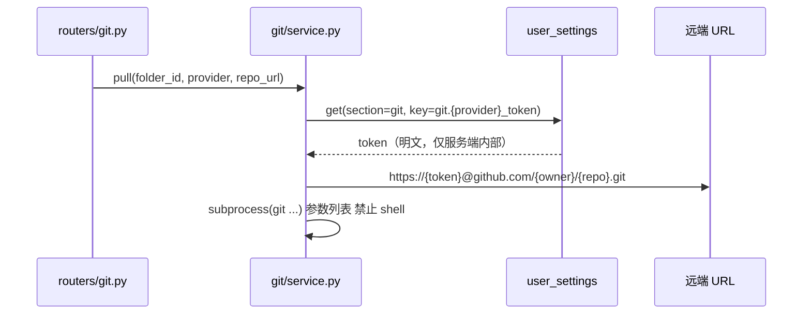

# Git 集成系统架构文档

> 粒度：L4 ｜ 版本：1.0 ｜ 日期：2026-08-07

## 1. 架构总览

Git 集成横跨前端（Next.js :3000）与后端网关（FastAPI :8001）。凭证与仓库绑定存数据库；git 命令在网关侧执行（本机 git 2.54）；嵌入式存储（DB）与磁盘 git 工作目录之间通过「落盘/落库」双向桥接。

```mermaid
flowchart TB
    subgraph FE[前端 Next.js :3000]
        A[设置 → Git 集成页<br/>GitHub/Gitee Token 配置]
        B[会话区输入框工具栏<br/>拉取按钮 / 推送按钮]
        C[会话显示区<br/>Git 操作日志面板]
    end
    subgraph GW[网关 FastAPI :8001]
        D[routers/git.py<br/>config / pull / push]
        E[git/service.py<br/>token 解析 工作目录管理 命令执行]
        F[routers/workspaces.py<br/>folder git 绑定读写]
    end
    subgraph DB[(数据库 schema: tianshu)]
        G[user_settings<br/>git.github_token / git.gitee_token]
        H[folders<br/>git_provider / git_repo_url]
        I[workspace_files<br/>嵌入式内容]
    end
    subgraph DISK[磁盘]
        J[data/git/{user_id}/{folder_id}/<br/>.git + 工作树]
    end
    A -->|GET/PUT /api/git/config| D
    D --> G
    B -->|POST /api/git/pull| D
    B -->|POST /api/git/push| D
    D --> E
    E --> J
    E --> G
    E --> I
    D -->|SSE 日志流| C
    B -->|GET/PUT /api/folders/{id}/git| F
    F --> H
```

## 2. 组件职责

| 组件 | 职责 |
|------|------|
| `routers/git.py` | `GET/PUT /api/git/config`（凭证）；`POST /api/git/pull`、`POST /api/git/push`（SSE 流式执行） |
| `routers/workspaces.py` | 扩展 `GET/PUT /api/folders/{folder_id}/git`：文件夹-仓库绑定读写 |
| `git/service.py` | 核心 git 编排：token 解析、工作目录管理、落盘/落库桥接、参数化 git 命令执行、SSE 日志发射 |
| `git/disk_bridge.py` | 嵌入式文件（DB）↔ 磁盘工作树 双向同步（拉取落库、推送落盘） |
| `user_settings` 仓储 | section=`git` 的 key-value 存取（复用现有实现） |
| `workspaces` 仓储 | 文件夹 git 字段读写（复用现有实现 + 新字段） |

## 3. 关键设计

### 3.1 存储桥接（embedded ↔ disk）

TianShu 工作空间文件为**嵌入式存储**（内容在 DB，`storage_status=embedded`），而 git 必须操作磁盘。桥接规则：

- **拉取**：`git clone/pull` 到 `data/git/{user_id}/{folder_id}/` → 遍历工作树（跳过 `.git`）→ 逐文件 upsert 到文件夹 DB → 前端刷新文件列表即可见。
- **推送**：读取文件夹 DB 全部文件 → 落盘到工作树（覆盖同名、删除 DB 中不存在的文件除外，仅 add 磁盘现有）→ `git add -A` → `commit` → `push`。
- **文件删除同步**：拉取时磁盘无而 DB 有 → 删除 DB 文件；推送时 DB 无而磁盘有 → 保留（不删除远端），避免误删。

### 3.2 凭证解析



### 3.3 SSE 过程展示

- 拉取/推送接口返回 `text/event-stream`，事件类型 `log`（逐行命令输出）与 `done`（`{ok, message}`）。
- 前端 `fetch + ReadableStream` 消费，追加渲染到会话区 Git 操作日志面板；完成后按 `ok` 显示成功/失败摘要并刷新文件列表。

### 3.4 会话区动作状态机

| 动作 | 未绑定文件夹 | 已绑定文件夹 |
|------|-------------|-------------|
| 拉取 | 弹出工作空间/文件夹选择器 → 选中后执行拉取 | 直接拉取到绑定文件夹 |
| 推送 | 按钮禁用 + 提示先绑定/先拉取 | 推送整个绑定文件夹 |

## 4. 安全

- git 命令全部参数化执行（`subprocess.run([...])`），禁止拼接 shell。
- Token 仅存于 `user_settings`（明文入库、掩码出库），仅在服务端内部构造远端 URL，绝不进入前端或日志。
- 仓库 URL 仅支持 `https://`；构造凭据 URL 时不记录 Token 于日志。
