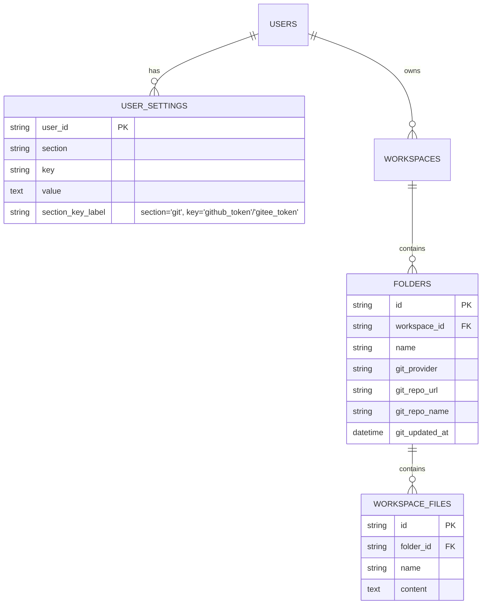

# Git 集成数据库文档

> 粒度：L4 ｜ 版本：1.0 ｜ 日期：2026-08-07

## 1. 表结构变更

### 1.1 新增字段：`tianshu.folders`

迁移 `0016_git_folder_fields`（down_revision = `0015_user_mcp`）。

| 字段 | 类型 | 约束 | 说明 |
|------|------|------|------|
| `git_provider` | VARCHAR(16) | NULL | 仓库平台：`github` / `gitee` / NULL（未绑定） |
| `git_repo_url` | VARCHAR(2048) | NULL | 远端仓库地址（`https://github.com/owner/repo.git`），不含 Token |
| `git_repo_name` | VARCHAR(255) | NULL | 仓库显示名（`owner/repo`），冗余便于前端展示 |
| `git_updated_at` | DateTime(timezone=True) | NULL | 最近一次成功拉取/推送时间 |

- `git_repo_url` 不建唯一索引：同一仓库可被不同文件夹绑定（多副本），`UNIQUE(git_repo_url)` 仅用于展示提示不强制。
- 文件夹与仓库一对一：同一文件夹同时只维护一个绑定（写入即覆盖）。

### 1.2 复用表：`tianshu.user_settings`

GitHub/Gitee 凭证存入现有用户设置表（按 `(user_id, section, key)` 隔离）。

| section | key | 值 | 说明 |
|---------|-----|----|------|
| `git` | `github_token` | PAT 明文 | GitHub Personal Access Token |
| `git` | `gitee_token` | PAT 明文 | Gitee 私有令牌 |

- **明文入库、掩码出库**：API 层只返回 `configured` 布尔与掩码占位，明文仅服务端内部使用。
- 清空语义：PUT 请求中值为空字符串/`null` → 删除对应 key（与 `user_models`/`user_settings` 既有语义一致）。

## 2. ER 图

## 3. 数据流说明

- 拉取：`git clone/pull` → 磁盘工作树 → `workspace_files`（folder_id 下 upsert/删除）。
- 推送：`workspace_files`（folder_id 全部文件）→ 磁盘工作树 → `git add/commit/push`。
- 凭证：`user_settings` 按 `user_id` 读取，用于构造 `https://{token}@host/...` 远端 URL。
- 文件夹 git 字段：`folders.git_provider / git_repo_url / git_repo_name`，由 `PUT /api/folders/{id}/git` 写入，`git_updated_at` 由拉取/推送成功时更新。

## 4. 迁移

- `0016_git_folder_fields`：幂等检查（`has_column`）→ `ALTER TABLE tianshu.folders ADD COLUMN git_provider ...`；downgrade 删除 4 列。
- 执行 `alembic upgrade head` 应用。
- ORM 模型 `FolderRow` 增加对应 4 字段（`persistence/workspaces/model.py`），供 `Base.metadata` / autogenerate 注册。
