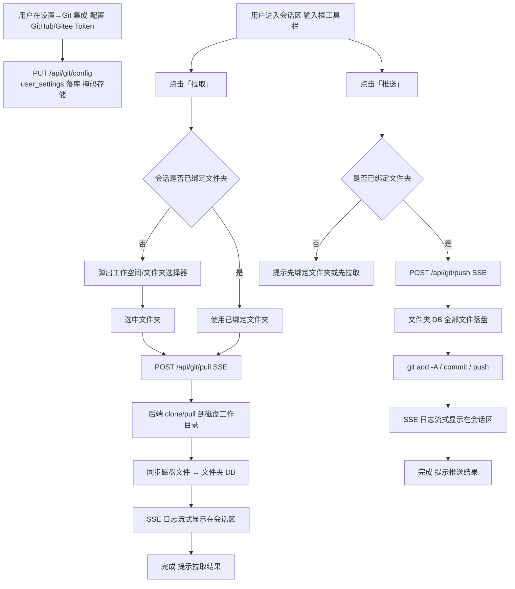

# Git 集成（GitHub / Gitee 拉取与推送）需求文档

> 粒度：L5 ｜ 版本：1.0 ｜ 日期：2026-08-07

## 1. 背景与目标

TianShu 平台当前缺少与代码仓库（GitHub / Gitee）的协作能力：用户无法把远端仓库内容拉到平台中编辑，也无法把平台中（工作空间文件夹内）的文档/代码推回远端仓库。

**目标**：建立「Git 集成」子系统——用户在设置中配置 GitHub / Gitee 的 PAT Token（个人访问令牌）；在会话区通过「拉取 / 推送」两个动作，把远端仓库与当前会话绑定的工作空间文件夹双向同步，操作过程在会话显示区实时展示。**全程使用真实数据库数据，禁止 Mock。**

## 2. 范围

### 2.1 纳入本需求

1. **凭证配置**：设置页新增「Git 集成」模块，用户分别配置 GitHub、Gitee 的 PAT Token（存 `user_settings`，按 `user_id` 隔离，显示掩码）。
2. **文件夹-仓库绑定**：文件夹（工作空间）可关联一个远端仓库（provider + repo_url），持久化到 `folders` 表新增字段。
3. **拉取（Pull）**：把远端仓库同步到当前会话绑定的文件夹；**首次拉取时若会话未绑定文件夹，弹出工作空间/文件夹选择器**；后续拉取默认到已绑定的文件夹。
4. **推送（Push）**：把绑定文件夹中的全部文件变更（新增/修改/删除）提交并推送到远端仓库。
5. **过程显示**：拉取/推送执行过程（git 命令日志）通过 SSE 流式展示在**会话显示区**。
6. **会话区动作**：输入框工具栏新增「拉取」「推送」两个按钮（与绑定文件夹、MCP 菜单同排）。

### 2.2 不在本需求

- **OAuth 授权登录**：仅支持 PAT Token（用户明确选择）。
- **分支管理**：默认使用当前分支拉取/推送，不提供分支切换 UI（git 命令层面保留 checkout 能力，不在 UI 暴露）。
- **冲突解决 UI**：推送被远端拒绝时仅报错展示日志，不提供图形化合并。
- **GitHub/Gitee 的 Issue/PR 等**：仅仓库拉取/推送。
- **agent 自主 git 工具**：git 操作为用户主动触发，不注入 agent 工具。

## 3. 业务规则

1. **凭证用户隔离**：GitHub/Gitee Token 存 `user_settings`（section=`git`），读写以 `get_effective_user_id()` 为边界；任何接口禁止读取其他用户的 Token。
2. **掩码显示**：Token 保存后 API 只返回 `configured: true/false` 与掩码占位，不回显明文；未保存过返回 `configured: false`。
3. **文件夹即仓库**：仓库绑定挂在**文件夹**上（非会话、非线程），同一文件夹多次会话共享绑定；文件夹与仓库是一对一关系（`UNIQUE(folder_id)` 语义，一次一个 repo_url）。
4. **首次拉取选文件夹**：会话未绑定文件夹时点击「拉取」→ 先进入工作空间/文件夹选择；选中后立即拉取并写入该文件夹。
5. **后续拉取默认**：会话已绑定文件夹 → 直接拉取到该文件夹，不再弹选择。
6. **推送范围**：推送绑定文件夹的全部文件（新增/修改/删除），跳过 `.git` 目录。
7. **磁盘工作目录**：后端维护用户级 git 缓存目录（`data/git/{user_id}/{folder_id}`），作为仓库与嵌入式存储（DB）之间的桥接：拉取后落库、推送前落盘。
8. **过程展示**：拉取/推送全程 SSE 流式输出（命令、结果、错误）；会话区展示为 Git 操作日志面板，结束时显示成功/失败摘要。
9. **命令安全**：git 命令一律以参数列表方式执行（禁止 shell 拼接），repo_url/token 仅注入远端 URL 构造，杜绝注入。
10. **失败安全**：git 操作失败（认证失败、网络错误、冲突）返回结构化错误并完整展示日志，不破坏文件夹已有文件（推送前若落盘/提交失败则终止，不回写 DB）。

## 4. 业务流程

