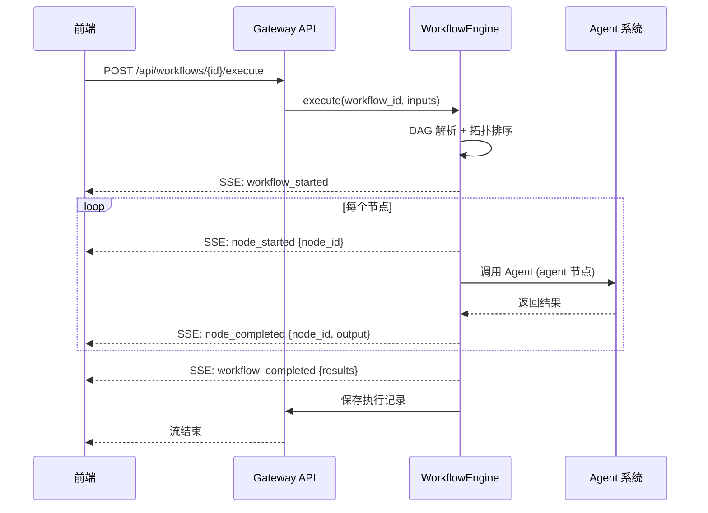
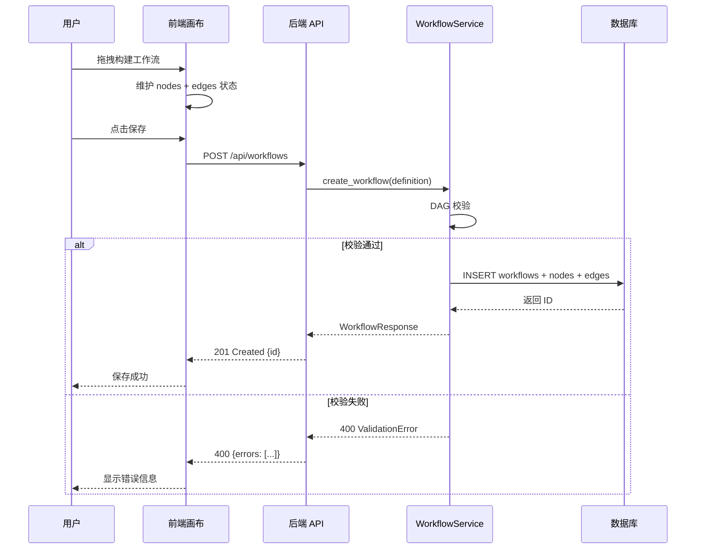
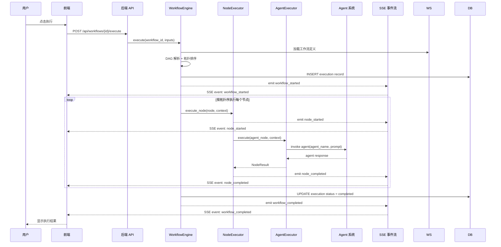

# 多 Agent 协作与编排（Workflow Orchestration）接口文档

## 1. 接口总览

### 1.1 路由前缀

```
/api/workflows
```

### 1.2 接口列表

| 方法 | 路径 | 说明 |
|------|------|------|
| POST | /api/workflows | 创建工作流 |
| GET | /api/workflows | 获取工作流列表 |
| GET | /api/workflows/{id} | 获取工作流详情 |
| PUT | /api/workflows/{id} | 更新工作流 |
| DELETE | /api/workflows/{id} | 删除工作流 |
| POST | /api/workflows/{id}/execute | 执行工作流（SSE） |
| POST | /api/workflows/{id}/validate | 校验工作流 DAG |
| POST | /api/workflows/{id}/copy | 复制工作流 |
| GET | /api/workflows/{id}/executions | 获取执行历史 |
| GET | /api/workflows/executions/{execution_id} | 获取执行详情 |
| POST | /api/workflows/executions/{execution_id}/cancel | 取消执行 |

---

## 2. 接口详细定义

### 2.1 创建工作流

**请求**：
```
POST /api/workflows
```

```json
{
  "name": "市场调研分析",
  "description": "自动完成市场调研和分析报告生成",
  "definition": {
    "nodes": [
      {
        "id": "node-input",
        "type": "input",
        "name": "用户查询",
        "config": { "input_key": "query", "default_value": "" },
        "position": { "x": 100, "y": 200 }
      },
      {
        "id": "node-research",
        "type": "agent",
        "name": "调研员",
        "config": { "agent_name": "researcher" },
        "position": { "x": 300, "y": 200 }
      }
    ],
    "edges": [
      {
        "id": "edge-1",
        "source": "node-input",
        "target": "node-research",
        "label": "查询内容"
      }
    ]
  },
  "input_schema": {
    "type": "object",
    "properties": {
      "query": { "type": "string", "description": "调研主题" }
    }
  }
}
```

**响应**（201）：
```json
{
  "id": "wf-a1b2c3d4e5f6",
  "name": "市场调研分析",
  "description": "自动完成市场调研和分析报告生成",
  "definition": { ... },
  "input_schema": { ... },
  "output_schema": null,
  "is_template": false,
  "version": 1,
  "created_at": "2026-08-05T10:00:00Z",
  "updated_at": "2026-08-05T10:00:00Z"
}
```

### 2.2 获取工作流列表

**请求**：
```
GET /api/workflows?search=&sort_by=updated_at&order=desc&offset=0&limit=20
```

**响应**（200）：
```json
{
  "total": 15,
  "workflows": [
    {
      "id": "wf-a1b2c3d4e5f6",
      "name": "市场调研分析",
      "description": "自动完成市场调研和分析报告生成",
      "node_count": 5,
      "is_template": false,
      "created_at": "2026-08-05T10:00:00Z",
      "updated_at": "2026-08-05T10:30:00Z",
      "last_execution_status": "completed"
    }
  ]
}
```

### 2.3 获取工作流详情

**请求**：
```
GET /api/workflows/{id}
```

**响应**（200）：
```json
{
  "id": "wf-a1b2c3d4e5f6",
  "name": "市场调研分析",
  "definition": { ... },
  "created_at": "2026-08-05T10:00:00Z",
  "updated_at": "2026-08-05T10:30:00Z"
}
```

### 2.4 更新工作流

**请求**：
```
PUT /api/workflows/{id}
```

```json
{
  "name": "更新后的名称",
  "description": "更新后的描述",
  "definition": { ... }
}
```

**响应**（200）：
```json
{
  "id": "wf-a1b2c3d4e5f6",
  "name": "更新后的名称",
  ...
}
```

### 2.5 删除工作流

**请求**：
```
DELETE /api/workflows/{id}
```

**响应**（204）：无内容

### 2.6 执行工作流（SSE）

**请求**：
```
POST /api/workflows/{id}/execute
Content-Type: application/json
Accept: text/event-stream
```

```json
{
  "inputs": {
    "query": "AI Agent 市场趋势分析"
  }
}
```

**SSE 事件序列**：



**SSE 事件格式**：

```
event: workflow_started
data: {"execution_id": "exec-001", "workflow_id": "wf-001"}

event: node_started
data: {"node_id": "node-1", "node_type": "input"}

event: node_completed
data: {"node_id": "node-1", "output": {"query": "AI Agent 市场趋势"}}

event: node_started
data: {"node_id": "node-2", "node_type": "agent"}

event: node_completed
data: {"node_id": "node-2", "output": {"research_result": "..."}}

event: workflow_completed
data: {"execution_id": "exec-001", "results": {"final_output": "..."}}
```

### 2.7 校验工作流 DAG

**请求**：
```
POST /api/workflows/{id}/validate
```

```json
{
  "definition": { ... }
}
```

**响应**（200）：
```json
{
  "valid": true,
  "errors": [],
  "warnings": [],
  "topology": {
    "node_count": 5,
    "edge_count": 4,
    "has_cycle": false,
    "entry_nodes": ["node-input"],
    "exit_nodes": ["node-output"],
    "parallel_groups": [["node-input"], ["node-research"], ["node-analysis"], ["node-code"], ["node-output"]]
  }
}
```

### 2.8 复制工作流

**请求**：
```
POST /api/workflows/{id}/copy
```

```json
{
  "name": "副本 - 市场调研分析"
}
```

**响应**（201）：
```json
{
  "id": "wf-z9y8x7w6v5u4",
  "name": "副本 - 市场调研分析",
  ...
}
```

### 2.9 获取执行历史

**请求**：
```
GET /api/workflows/{id}/executions?offset=0&limit=20
```

**响应**（200）：
```json
{
  "total": 42,
  "executions": [
    {
      "id": "exec-001",
      "status": "completed",
      "started_at": "2026-08-05T10:00:00Z",
      "completed_at": "2026-08-05T10:05:00Z",
      "duration_ms": 300000
    }
  ]
}
```

### 2.10 获取执行详情

**请求**：
```
GET /api/workflows/executions/{execution_id}
```

**响应**（200）：
```json
{
  "id": "exec-001",
  "workflow_id": "wf-001",
  "status": "completed",
  "inputs": { "query": "AI Agent 市场趋势" },
  "outputs": { "final_output": "..." },
  "steps": [
    {
      "id": "step-001",
      "node_id": "node-1",
      "status": "completed",
      "input_data": { "query": "..." },
      "output_data": { "query": "..." },
      "duration_ms": 50,
      "started_at": "2026-08-05T10:00:00Z",
      "completed_at": "2026-08-05T10:00:00Z"
    }
  ]
}
```

### 2.11 取消执行

**请求**：
```
POST /api/workflows/executions/{execution_id}/cancel
```

**响应**（200）：
```json
{
  "id": "exec-001",
  "status": "cancelled"
}
```

---

## 3. 错误码

| HTTP 状态码 | 错误码 | 说明 |
|-------------|--------|------|
| 400 | `invalid_definition` | 工作流定义格式错误 |
| 400 | `dag_cycle_detected` | DAG 存在环路 |
| 400 | `dag_disconnected` | DAG 存在断开的节点 |
| 404 | `workflow_not_found` | 工作流不存在 |
| 409 | `workflow_in_use` | 工作流正在执行中 |
| 500 | `execution_failed` | 执行失败（详见 error_message） |
| 500 | `node_execution_error` | 节点执行错误 |

---

## 4. 接口调用时序图

### 4.1 工作流创建与保存



### 4.2 工作流执行


