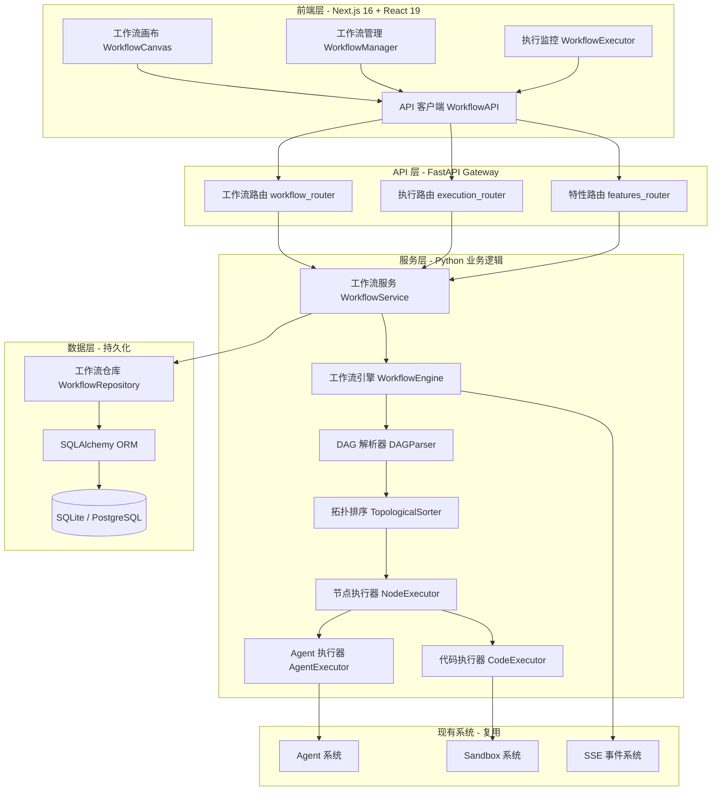
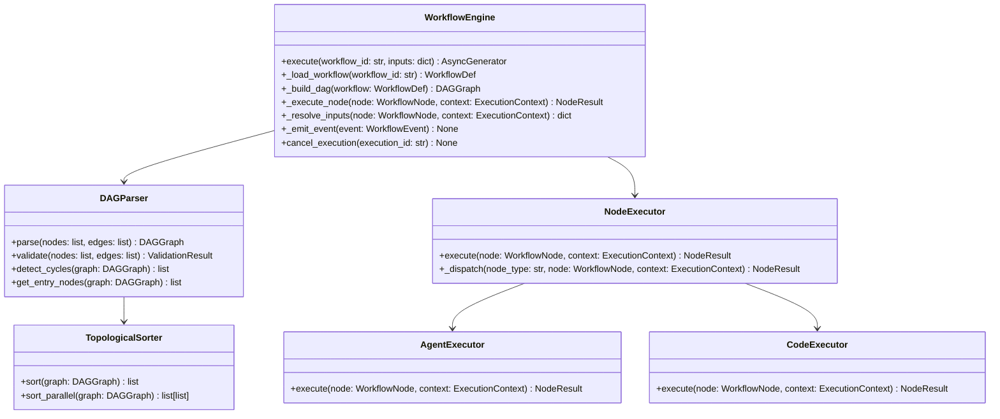
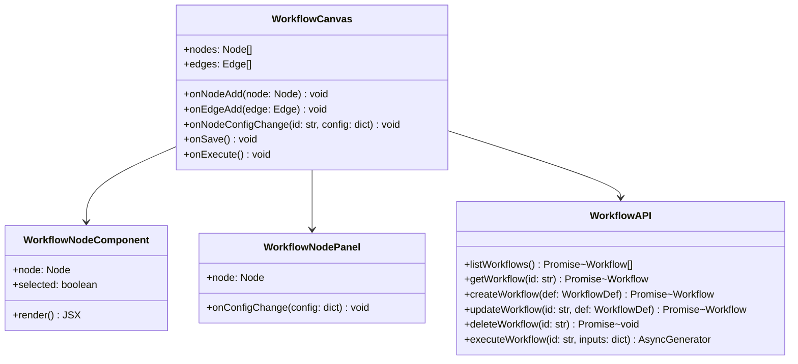
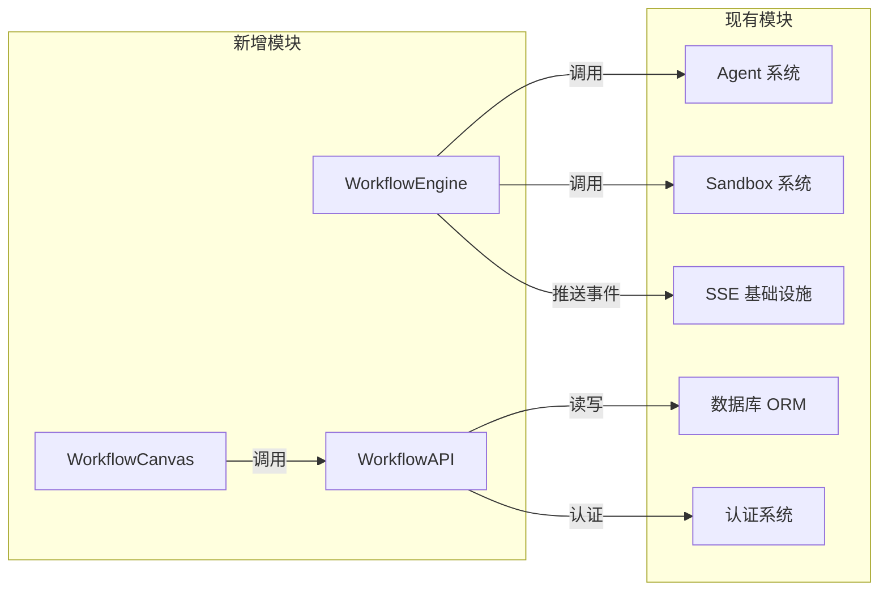

# 多 Agent 协作与编排（Workflow Orchestration）系统架构文档

## 1. 系统架构总览

### 1.1 架构图



### 1.2 技术选型

| 层次 | 技术 | 版本 | 选型理由 |
|------|------|------|----------|
| 前端框架 | Next.js | 16.x | 项目现有技术栈，App Router + Server Components |
| UI 组件 | React Flow | 11.x | 成熟的节点式流程图库，支持拖拽/连线/缩放 |
| 状态管理 | TanStack Query | 5.x | 项目现有技术栈，服务端状态管理 |
| 样式 | Tailwind CSS | 4.x | 项目现有技术栈 |
| 后端框架 | FastAPI | 现有 | 项目现有技术栈，异步 API |
| ORM | SQLAlchemy | 2.x | 项目现有技术栈，声明式 Base |
| 数据库 | SQLite/PostgreSQL | 现有 | 项目现有技术栈 |
| DAG 算法 | 自研拓扑排序 | - | 基于 Kahn 算法实现，避免额外依赖 |
| SSE | FastAPI StreamingResponse | 现有 | 项目现有 SSE 基础设施 |

---

## 2. 模块设计

### 2.1 后端模块结构

```
backend/packages/harness/tianshu/
├── workflow/                          # 新增：工作流模块
│   ├── __init__.py
│   ├── engine/
│   │   ├── __init__.py
│   │   ├── engine.py                  # 工作流引擎核心
│   │   ├── dag_parser.py              # DAG 解析与校验
│   │   ├── topo_sorter.py             # 拓扑排序算法
│   │   └── node_executor.py           # 节点执行器调度
│   ├── executors/
│   │   ├── __init__.py
│   │   ├── agent_executor.py          # Agent 节点执行器
│   │   ├── code_executor.py           # 代码节点执行器
│   │   ├── input_executor.py          # 输入节点执行器
│   │   └── output_executor.py         # 输出节点执行器
│   ├── models/
│   │   ├── __init__.py
│   │   └── workflow.py                # 工作流数据模型
│   ├── repository/
│   │   ├── __init__.py
│   │   └── workflow_repo.py           # 工作流数据访问
│   └── schemas/
│       ├── __init__.py
│       └── workflow.py                # Pydantic 请求/响应模型
└── persistence/
    ├── models/
    │   └── workflow.py                # 新增：ORM 模型
    └── migrations/
        └── versions/
            └── 0011_workflows.py      # 新增：迁移脚本
```

### 2.2 前端模块结构

```
frontend/src/
├── app/
│   └── workspace/
│       ├── workflows/
│       │   ├── page.tsx               # 新增：工作流列表页
│       │   ├── new/
│       │   │   └── page.tsx           # 新增：创建工作流
│       │   └── [workflow_id]/
│       │       ├── page.tsx           # 新增：工作流详情/画布页
│       │       └── execute/
│       │           └── page.tsx       # 新增：执行监控页
│       └── agents/
│           └── page.tsx               # 现有：Agent 列表（添加导航入口）
├── components/
│   └── workspace/
│       ├── workflows/
│       │   ├── workflow-canvas.tsx     # 新增：工作流画布组件
│       │   ├── workflow-node.tsx       # 新增：节点组件（React Flow 自定义节点）
│       │   ├── workflow-edge.tsx       # 新增：连线组件
│       │   ├── workflow-toolbar.tsx    # 新增：工具栏
│       │   ├── workflow-node-panel.tsx # 新增：节点配置面板
│       │   ├── workflow-execution.tsx  # 新增：执行状态组件
│       │   └── workflow-list.tsx       # 新增：工作流列表组件
│       └── workspace-sidebar.tsx       # 修改：添加工作流导航入口
├── core/
│   └── workflows/
│       ├── api.ts                     # 新增：API 客户端
│       ├── types.ts                   # 新增：类型定义
│       └── hooks.ts                   # 新增：React Hooks
└── lib/
    └── workflow/
        └── validation.ts               # 新增：DAG 校验工具
```

### 2.3 核心类设计

#### 2.3.1 后端核心类

**WorkflowEngine（工作流引擎）**



#### 2.3.2 前端核心类/组件



---

## 3. 关键设计决策

### 3.1 DAG 执行引擎

**算法选择**：采用 Kahn 算法进行拓扑排序，时间复杂度 O(V+E)。

**执行策略**：
1. 解析 DAG 图，进行拓扑排序
2. 按排序顺序逐层执行，同层节点可并行
3. 每个节点从上游节点收集输出作为输入
4. 节点执行结果通过 SSE 实时推送

**数据传递**：
- 每个节点有 `output_schema` 定义输出结构
- 下游节点通过 `input_mapping` 声明如何从上游节点获取数据
- 引擎在执行时自动解析依赖关系，组装节点输入

### 3.2 节点执行器架构

采用**策略模式**实现可扩展的节点执行器：

```python
class NodeExecutorRegistry:
    _executors: dict[str, NodeExecutor] = {}

    @classmethod
    def register(cls, node_type: str, executor: NodeExecutor):
        cls._executors[node_type] = executor

    @classmethod
    def get(cls, node_type: str) -> NodeExecutor:
        return cls._executors[node_type]
```

现有节点类型：
- `agent` → AgentExecutor（调用现有 Agent 系统）
- `code` → CodeExecutor（调用现有 Sandbox 系统）
- `input` → InputExecutor（接收初始输入）
- `output` → OutputExecutor（聚合最终输出）

### 3.3 SSE 事件协议

执行过程中通过 SSE 推送以下事件类型：

| 事件类型 | 说明 | 载荷 |
|----------|------|------|
| `workflow_started` | 工作流开始执行 | `{ execution_id, workflow_id }` |
| `node_started` | 节点开始执行 | `{ node_id, node_type }` |
| `node_completed` | 节点执行完成 | `{ node_id, output }` |
| `node_failed` | 节点执行失败 | `{ node_id, error }` |
| `workflow_completed` | 工作流执行完成 | `{ execution_id, results }` |
| `workflow_cancelled` | 工作流被取消 | `{ execution_id }` |

### 3.4 前端画布实现

**技术选择**：React Flow v11

**理由**：
- 成熟稳定，社区活跃
- 内置节点拖拽、连线、缩放、平移
- 支持自定义节点和连线组件
- 支持 undo/redo（通过内置的 `useUndoRedo` 或自定义实现）
- 性能优异，支持 100+ 节点流畅渲染

**自定义节点**：
- `agentNode`：展示 Agent 配置，包含 Agent 选择下拉框
- `codeNode`：展示代码编辑器，包含 Python 代码片段
- `inputNode`：展示输入配置
- `outputNode`：展示输出配置
- `conditionNode`：展示条件表达式编辑器

---

## 4. 部署与集成

### 4.1 与现有系统集成



### 4.2 配置项

在 `config.yaml` 中新增工作流配置：

```yaml
workflows:
  enabled: true
  engine:
    max_parallel_nodes: 10
    node_timeout: 300
    max_retries: 0
  sse:
    event_buffer_size: 100
```

---

## 5. 安全设计

### 5.1 数据隔离

- 工作流数据通过 `user_id` 字段实现用户级隔离
- 查询条件始终包含 `user_id` 过滤
- 禁止跨用户访问

### 5.2 代码执行安全

- 代码节点在隔离 Sandbox 中执行
- 限制可用的 Python 模块
- 资源使用监控（CPU/内存/执行时间）

### 5.3 API 安全

- 所有 API 需通过现有 Session 认证
- 工作流执行需校验用户权限
- 操作审计日志
