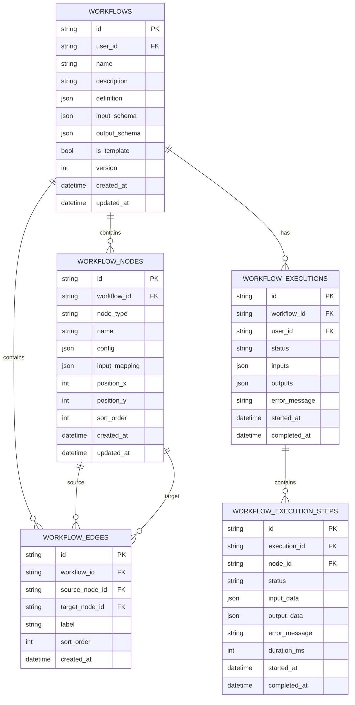
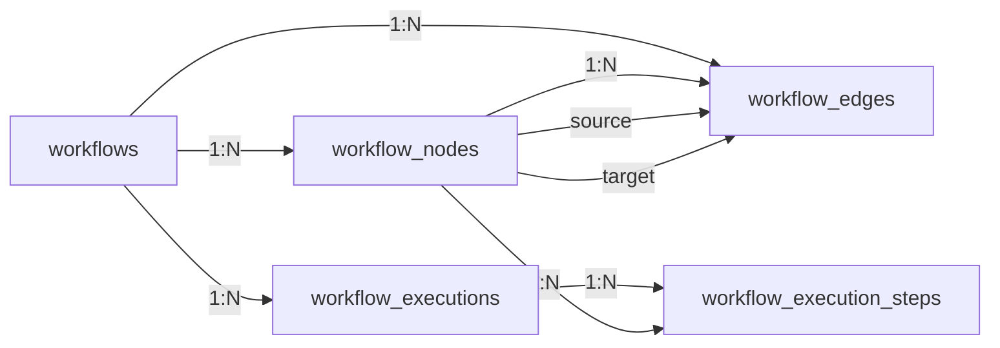

# 多 Agent 协作与编排（Workflow Orchestration）数据库文档

## 1. ER 图



---

## 2. 表结构定义

### 2.1 workflows（工作流表）

| 字段 | 类型 | 约束 | 说明 |
|------|------|------|------|
| id | VARCHAR(64) | PK | 工作流唯一标识（UUID） |
| user_id | VARCHAR(64) | FK, INDEX | 创建用户 ID |
| name | VARCHAR(256) | NOT NULL | 工作流名称 |
| description | TEXT | | 工作流描述 |
| definition | JSON | NOT NULL | 完整的工作流定义（含节点和连线的 JSON 结构） |
| input_schema | JSON | | 输入参数的 JSON Schema |
| output_schema | JSON | | 输出结果的 JSON Schema |
| is_template | BOOLEAN | DEFAULT false | 是否为模板 |
| version | INTEGER | DEFAULT 1 | 版本号 |
| created_at | DATETIME(TZ) | NOT NULL | 创建时间 |
| updated_at | DATETIME(TZ) | NOT NULL | 更新时间 |

**索引**：
- `ix_workflows_user_id` ON (user_id)

**说明**：
- `definition` 字段存储完整的工作流画布定义，包括所有节点配置和连线关系
- 采用 JSON 存储整个定义，便于前端直接保存/恢复画布状态
- `definition` 结构示例：
  ```json
  {
    "nodes": [
      {
        "id": "node-1",
        "type": "agent",
        "name": "调研员",
        "config": { "agent_name": "researcher" },
        "position": { "x": 100, "y": 200 }
      }
    ],
    "edges": [
      {
        "id": "edge-1",
        "source": "node-1",
        "target": "node-2",
        "label": "调研结果"
      }
    ]
  }
  ```

### 2.2 workflow_nodes（工作流节点表）

| 字段 | 类型 | 约束 | 说明 |
|------|------|------|------|
| id | VARCHAR(64) | PK | 节点唯一标识（UUID） |
| workflow_id | VARCHAR(64) | FK, INDEX | 所属工作流 ID |
| node_type | VARCHAR(32) | NOT NULL | 节点类型：agent/code/input/output/condition |
| name | VARCHAR(256) | NOT NULL | 节点名称 |
| config | JSON | NOT NULL | 节点配置（Agent 名称/代码片段等） |
| input_mapping | JSON | | 输入映射（声明如何从上游节点获取数据） |
| position_x | INTEGER | | 画布 X 坐标 |
| position_y | INTEGER | | 画布 Y 坐标 |
| sort_order | INTEGER | DEFAULT 0 | 排序顺序 |
| created_at | DATETIME(TZ) | NOT NULL | 创建时间 |
| updated_at | DATETIME(TZ) | NOT NULL | 更新时间 |

**索引**：
- `ix_workflow_nodes_workflow_id` ON (workflow_id)

**说明**：
- 该表为冗余设计，便于按节点维度查询和统计
- 节点完整配置同时存储在 `workflows.definition` JSON 字段中
- `config` 字段根据 `node_type` 不同结构不同：
  - `agent`: `{ "agent_name": "researcher", "prompt_template": "..." }`
  - `code`: `{ "code": "print('hello')", "language": "python" }`
  - `input`: `{ "input_key": "user_query", "default_value": "" }`
  - `output`: `{ "output_key": "result", "aggregation": "last" }`

### 2.3 workflow_edges（工作流连线表）

| 字段 | 类型 | 约束 | 说明 |
|------|------|------|------|
| id | VARCHAR(64) | PK | 连线唯一标识（UUID） |
| workflow_id | VARCHAR(64) | FK, INDEX | 所属工作流 ID |
| source_node_id | VARCHAR(64) | FK, INDEX | 源节点 ID |
| target_node_id | VARCHAR(64) | FK, INDEX | 目标节点 ID |
| label | VARCHAR(128) | | 连线标签（描述数据流） |
| sort_order | INTEGER | DEFAULT 0 | 排序顺序 |
| created_at | DATETIME(TZ) | NOT NULL | 创建时间 |

**索引**：
- `ix_workflow_edges_workflow_id` ON (workflow_id)
- `ix_workflow_edges_source_node` ON (source_node_id)
- `ix_workflow_edges_target_node` ON (target_node_id)

**说明**：
- 同样为冗余设计，连线完整信息同时存储在 `workflows.definition` JSON 中
- `label` 字段用于描述数据流向的含义

### 2.4 workflow_executions（工作流执行表）

| 字段 | 类型 | 约束 | 说明 |
|------|------|------|------|
| id | VARCHAR(64) | PK | 执行唯一标识（UUID） |
| workflow_id | VARCHAR(64) | FK, INDEX | 执行的工作流 ID |
| user_id | VARCHAR(64) | FK, INDEX | 执行用户 ID |
| status | VARCHAR(32) | NOT NULL | 执行状态：pending/running/completed/failed/cancelled |
| inputs | JSON | | 执行输入参数 |
| outputs | JSON | | 执行输出结果 |
| error_message | TEXT | | 错误信息（失败时） |
| started_at | DATETIME(TZ) | NOT NULL | 开始时间 |
| completed_at | DATETIME(TZ) | | 完成时间 |

**索引**：
- `ix_workflow_executions_workflow_id` ON (workflow_id)
- `ix_workflow_executions_user_id` ON (user_id)
- `ix_workflow_executions_status` ON (status)

**说明**：
- 记录工作流的每次执行情况
- `outputs` 字段存储最终聚合的输出结果
- 用于历史回溯和执行分析

### 2.5 workflow_execution_steps（执行步骤表）

| 字段 | 类型 | 约束 | 说明 |
|------|------|------|------|
| id | VARCHAR(64) | PK | 步骤唯一标识（UUID） |
| execution_id | VARCHAR(64) | FK, INDEX | 所属执行 ID |
| node_id | VARCHAR(64) | FK, INDEX | 对应节点 ID |
| status | VARCHAR(32) | NOT NULL | 步骤状态：pending/running/completed/failed |
| input_data | JSON | | 节点输入数据 |
| output_data | JSON | | 节点输出数据 |
| error_message | TEXT | | 错误信息（失败时） |
| duration_ms | INTEGER | | 执行耗时（毫秒） |
| started_at | DATETIME(TZ) | NOT NULL | 开始时间 |
| completed_at | DATETIME(TZ) | | 完成时间 |

**索引**：
- `ix_exec_steps_execution_id` ON (execution_id)
- `ix_exec_steps_node_id` ON (node_id)
- `ix_exec_steps_status` ON (status)

**说明**：
- 记录每个节点的详细执行情况
- 用于调试和性能分析
- `duration_ms` 用于性能监控

---

## 3. 数据模型关系



**关系说明**：
- 一个工作流包含多个节点和连线
- 连线连接两个节点（source → target）
- 一个工作流可以被多次执行
- 每次执行包含多个执行步骤（对应每个节点）

---

## 4. 迁移脚本

### 4.1 迁移版本

- **版本号**: 0011_workflows
- **前序版本**: 0010_run_cancel_request
- **创建日期**: 2026-08-05

### 4.2 创建表顺序

1. `workflows`（主表）
2. `workflow_nodes`（节点表）
3. `workflow_edges`（连线表）
4. `workflow_executions`（执行表）
5. `workflow_execution_steps`（执行步骤表）

### 4.3 Seed 数据

创建一个示例工作流用于测试：

- **名称**: "市场调研分析报告"
- **节点**:
  1. 输入节点：接收用户查询
  2. Agent 节点：调研员（web search）
  3. Agent 节点：分析师（data analysis）
  4. 代码节点：格式化报告
  5. 输出节点：展示结果
- **连线**: 依次连接形成线性流程
