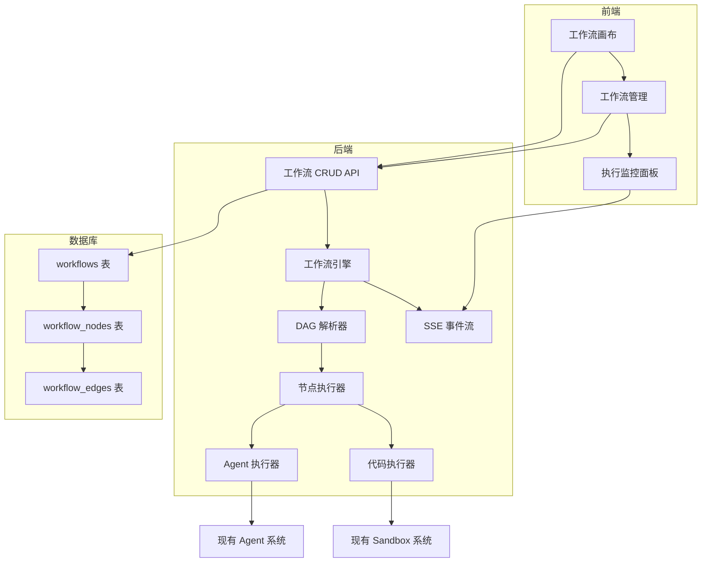
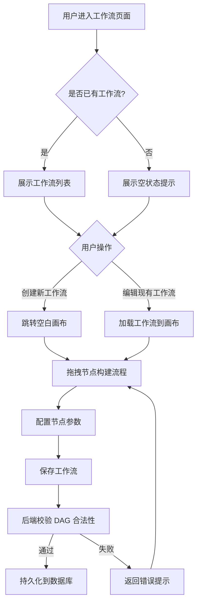
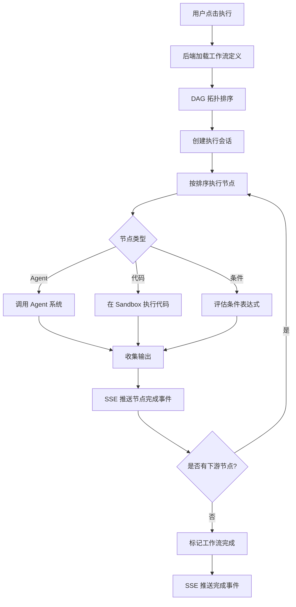

# 多 Agent 协作与编排（Workflow Orchestration）需求文档

## 1. 概述

### 1.1 背景

TianShu 目前已具备强大的 Agent 能力，包括主 Agent（Lead Agent）、子 Agent（Sub-Agent）的嵌套调用，以及丰富的 Skills 系统。然而，Agent 的编排仍然依赖隐式的 prompt 指令，缺乏可视化、可复用的编排机制。用户无法直观地定义 Agent 之间的协作流程，也难以将成功的 Agent 协作模式固化为可重复使用的工作流。

### 1.2 目标

引入**图形化 Agent 编排能力**，允许用户通过拖拽方式定义复杂的 Agent 工作流（Workflow），实现：

- **可视化编排**：通过拖拽画布定义 Agent 节点和数据流向
- **DAG 执行引擎**：基于有向无环图（DAG）的工作流执行引擎，支持串行、并行和条件分支
- **工作流复用**：将成功的 Agent 协作模式保存为可复用的工作流模板
- **实时监控**：执行过程可视化，实时展示各节点状态和产出

### 1.3 用户画像

| 角色 | 核心诉求 | 使用场景 |
|------|----------|----------|
| 产品经理 | 快速构建业务流程自动化 | 市场调研 → 分析 → 报告生成流水线 |
| 研发工程师 | 复用 Agent 协作模式 | 代码审查 → 测试 → 文档生成 |
| 运营人员 | 低代码自动化内容生产 | 热点追踪 → 内容创作 → 多平台发布 |

---

## 2. 功能需求

### 2.1 功能模块总览

### 2.2 功能需求清单

#### FR-01 工作流画布（优先级：P0）

| ID | 需求描述 | 验收标准 |
|----|----------|----------|
| FR-01.1 | 用户可通过拖拽添加节点到画布 | 支持从节点面板拖拽 Agent/代码/输入/输出节点到画布 |
| FR-01.2 | 用户可通过连线定义节点间的数据流向 | 支持拖拽节点端口创建有向连线，自动检测环路 |
| FR-01.3 | 用户可在节点中配置 Agent 或代码 | 节点支持选择现有 Agent 或编写 Python 代码片段 |
| FR-01.4 | 用户可保存工作流 | 保存到数据库，返回唯一 ID |
| FR-01.5 | 用户可加载/编辑已有工作流 | 从数据库加载并在画布中恢复完整状态 |
| FR-01.6 | 支持撤销/重做 | 画布操作支持 undo/redo |
| FR-01.7 | 支持画布缩放/平移 | 鼠标滚轮缩放，拖拽平移 |

#### FR-02 工作流管理（优先级：P0）

| ID | 需求描述 | 验收标准 |
|----|----------|----------|
| FR-02.1 | 工作流列表 | 展示当前用户所有工作流，支持搜索/排序 |
| FR-02.2 | 创建工作流 | 创建空白工作流并跳转到画布 |
| FR-02.3 | 更新工作流 | 更新名称、描述、画布配置 |
| FR-02.4 | 删除工作流 | 删除工作流及其所有节点和连线 |
| FR-02.5 | 复制工作流 | 复制现有工作流为新工作流 |
| FR-02.6 | 工作流详情 | 展示工作流元数据和节点统计 |

#### FR-03 工作流执行（优先级：P0）

| ID | 需求描述 | 验收标准 |
|----|----------|----------|
| FR-03.1 | 执行工作流 | 按 DAG 拓扑排序执行各节点，支持并行 |
| FR-03.2 | 实时状态推送 | 通过 SSE 推送各节点状态（pending/running/completed/failed） |
| FR-03.3 | 节点间数据传递 | 上游节点输出作为下游节点输入 |
| FR-03.4 | 执行结果查看 | 展示执行结果，包括各节点输出和整体产出 |
| FR-03.5 | 执行中断 | 支持用户中止正在执行的工作流 |
| FR-03.6 | 错误处理 | 节点失败时支持重试或标记为失败并继续 |

#### FR-04 节点类型（优先级：P1）

| ID | 需求描述 | 验收标准 |
|----|----------|----------|
| FR-04.1 | Agent 节点 | 调用现有 Agent 系统执行任务 |
| FR-04.2 | 代码节点 | 在 Sandbox 中执行 Python 代码 |
| FR-04.3 | 输入节点 | 接收用户输入或上游数据 |
| FR-04.4 | 输出节点 | 展示最终结果 |
| FR-04.5 | 条件节点 | 根据条件表达式分支执行 |
| FR-04.6 | 并行节点 | 同时执行多个分支 |

---

## 3. 业务流程

### 3.1 工作流创建流程

### 3.2 工作流执行流程

---

## 4. 非功能需求

### 4.1 性能

| 指标 | 目标值 |
|------|--------|
| 工作流保存响应时间 | < 500ms |
| 工作流加载响应时间 | < 300ms |
| 单节点执行调度延迟 | < 100ms |
| 画布渲染节点数量 | 支持 100+ 节点流畅操作 |

### 4.2 可靠性

- 工作流执行过程中 Gateway 重启可恢复
- 节点执行超时可配置（默认 300s）
- 支持最大重试次数配置（默认 0）

### 4.3 安全性

- 工作流数据仅限创建用户可见
- 代码节点执行在隔离 Sandbox 中
- API 需认证（复用现有 Session 机制）

### 4.4 可扩展性

- 节点类型可扩展（插件化注册）
- 执行器可扩展（支持新的执行后端）
- DAG 解析器支持循环检测和校验

---

## 5. 约束与假设

### 5.1 约束

- 必须复用现有的 Agent 系统和 Sandbox 系统
- 必须使用现有的数据库（SQLite/PostgreSQL）和 ORM（SQLAlchemy）
- 前端必须使用现有的 Next.js 16 + React 19 + Tailwind CSS 4 技术栈
- 不得引入未经评审的第三方依赖

### 5.2 假设

- 用户已配置好 Agent 系统（agents_api.enabled=true）
- Sandbox 环境已就绪（Local/Docker）
- 用户具备基本的流程编排概念
