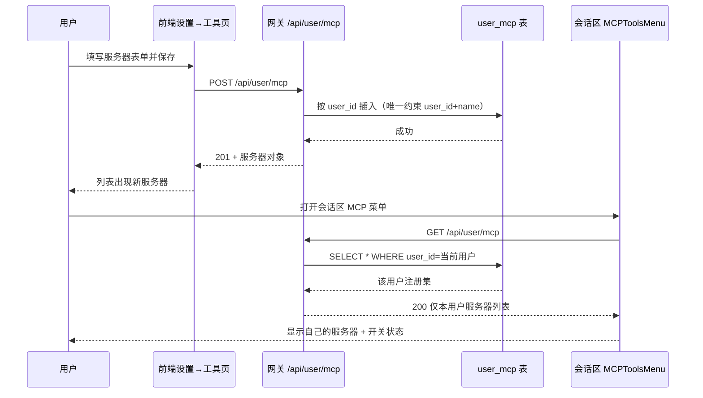
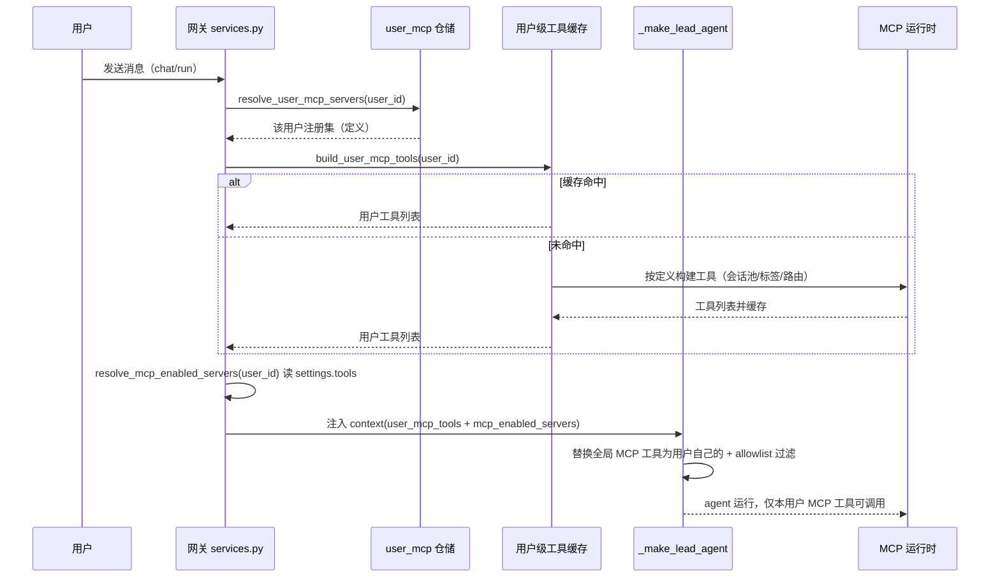

# 用户级 MCP 服务器注册（User MCP Registry）接口文档

> 粒度：L4 ｜ 版本：1.0 ｜ 日期：2026-08-07

## 1. 端点总览

| Method | Path | 说明 | 成功码 |
|--------|------|------|--------|
| GET | `/api/user/mcp` | 当前用户的服务器注册集 | 200 |
| GET | `/api/user/mcp/{name}` | 单个服务器详情 | 200 |
| POST | `/api/user/mcp` | 注册一台服务器 | 201 |
| PATCH | `/api/user/mcp/{name}` | 更新服务器（部分字段） | 200 |
| DELETE | `/api/user/mcp/{name}` | 删除服务器 | 204 |

- 所有端点以 `get_effective_user_id()` 为数据边界，**无 admin 校验**，任意登录用户可操作自己的注册集。
- 路径前缀经 `next.config.js` 的 `/api/:path*` rewrite 代理到网关 `/api/:path*`（既有配置，无需改动）。
- 状态变更请求需携带 `X-CSRF-Token`（`CSRFMiddleware` 既有要求）。

## 2. 数据模型

```json
{
  "name": "echo-server",
  "display_name": "Echo Server",
  "description": "本地 stdio echo 服务器",
  "transport": "stdio",
  "command": "python",
  "args": ["-m", "echo_server"],
  "env": {"API_KEY": "sk-***"},
  "url": null,
  "tool_name_prefix": true,
  "tool_call_timeout": 30.0,
  "created_at": "2026-08-07T10:00:00Z",
  "updated_at": "2026-08-07T10:00:00Z"
}
```

校验规则：
- `name`：`^[A-Za-z0-9][A-Za-z0-9._-]{0,127}$`，同用户内唯一。
- `transport` ∈ {`stdio`, `sse`, `http`}；`stdio` 必须带 `command`（`url` 必须为空）；`sse`/`http` 必须带 `url`（`command`/`args` 必须为空）。
- `args`：字符串数组；`env`：字符串键值对象。
- PATCH 采用 present-value 语义：请求体出现的字段即更新，未出现的保持不变；`env` 支持 `set_env`/`clear_env` 显式语义（镜像 `user_models` 的 `set_api_key` 模式）。

## 3. 接口时序

### 3.1 注册与菜单展示



### 3.2 会话运行（用户工具注入）



## 4. 错误码

| 状态码 | 场景 |
|--------|------|
| 400 | 校验失败（非法 name / transport 与必填字段不匹配 / args、env 结构错误） |
| 401 | 未登录（`AuthMiddleware` 既有行为） |
| 404 | `{name}` 不存在（GET/PATCH/DELETE） |
| 409 | `name` 与既有记录冲突（POST） |
| 500 | 落库异常（fail-soft 日志后返回通用错误） |

## 5. 前端接入点

| 位置 | 改动 |
|------|------|
| `core/user-mcp/api.ts`（新） | `loadUserMCPServers` / `createUserMCPServer` / `updateUserMCPServer` / `deleteUserMCPServer`；状态变更走 `fetcher.ts` CSRF 包装 |
| `core/user-mcp/hooks.ts`（新） | `useUserMCPServers` + CRUD mutations（成功后 invalidate `["userMcp"]`） |
| `components/workspace/mcp-tools-menu.tsx` | 列表数据源 `useMCPConfig()` → `useUserMCPServers()`；空态提示前往设置页 |
| `components/workspace/settings/tool-settings-page.tsx` | 新增「我的 MCP 服务器」CRUD 区（复用 `MCPServerDialog` 表单结构）；个性化偏好卡列表 = 自己的服务器 |
