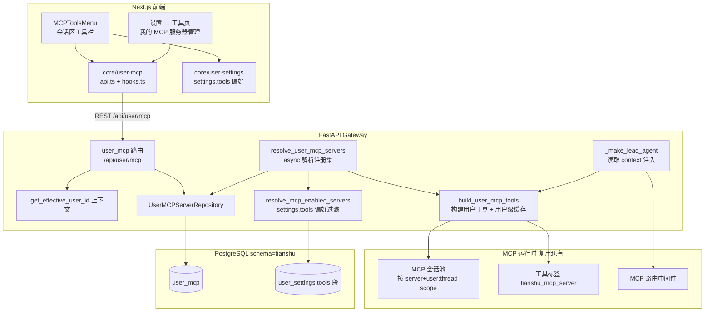

# 用户级 MCP 服务器注册（User MCP Registry）系统架构文档

> 粒度：L4 ｜ 版本：1.0 ｜ 日期：2026-08-07

## 1. 架构总览

## 2. 模块划分

| 模块 | 路径（规划） | 职责 |
|------|------|------|
| ORM 模型 | `tianshu/persistence/user_mcp/model.py` | `UserMCPServerRow`（表 `user_mcp`） |
| 仓储 | `tianshu/persistence/user_mcp/sql.py` | 异步 CRUD（list/get/create/update/delete），全部按 `user_id` 过滤 |
| 迁移 | `tianshu/persistence/migrations/versions/0015_user_mcp.py` | 建表（幂等） |
| 路由 | `app/gateway/routers/user_mcp.py` | `GET/POST/PATCH/DELETE /api/user/mcp`，`get_effective_user_id()` 边界 |
| 运行时解析 | `tianshu/mcp/user_registry.py` | `resolve_user_mcp_servers(user_id)`：读注册集 → 构建工具（缓存） |
| 工具构建 | `tianshu/mcp/tools.py`（重构） | 抽出 `build_mcp_tools(servers_config)`，全局与用户级共用 |
| 用户级缓存 | `tianshu/mcp/user_cache.py` | `dict[user_id, list[BaseTool]]` + 显式失效 |
| 偏好过滤 | `tianshu/tools/mcp_filter.py`（复用） | `resolve_mcp_enabled_servers` + `filter_mcp_tools`（语义=用户自己的全局） |
| Agent 注入 | `app/gateway/services.py` | chat/run 时 async 解析并注入 `config["context"]` |
| 前端 API | `frontend/src/core/user-mcp/api.ts` | `/api/user/mcp` fetch 封装（走 `fetcher.ts` CSRF 包装） |
| 前端 hooks | `frontend/src/core/user-mcp/hooks.ts` | TanStack Query 查询/变更 |
| 前端组件 | `MCPToolsMenu` / `tool-settings-page.tsx` | 菜单数据源切换 + 我的 MCP 服务器 CRUD |

## 3. 数据流

1. **注册**：用户打开设置 → 工具页 → 添加服务器 → `POST /api/user/mcp` → 按 `user_id` 落库 `user_mcp` → 失效该用户 MCP 工具缓存。
2. **菜单展示**：会话区 `MCPToolsMenu` 挂载 → `GET /api/user/mcp` 返回当前用户注册集 → 与 `settings.tools`（`inherit_global`/`enabled_servers`）合并渲染开关状态。
3. **会话运行**：
   - 用户发送消息 → `services.py` chat/run 处理（现有 L1179-1190 注入点扩展）：
     - `resolve_user_mcp_servers(user_id)`：读 `user_mcp` → 服务器定义 map；
     - `build_user_mcp_tools(user_id)`：按定义构建工具（用户级缓存，命中即返回）；
     - `resolve_mcp_enabled_servers(user_id)`：读 `settings.tools` 偏好 allowlist；
     - 注入 `config["context"]["user_mcp_tools"]` 与 `config["context"]["mcp_enabled_servers"]`。
   - `_make_lead_agent`：读取 context —— `user_mcp_tools` 存在时，**替换** `get_available_tools` 中的全局 MCP 工具为该用户自己的工具（非 MCP 工具保留），随后照常执行 `filter_mcp_tools` 按 allowlist 过滤、授权过滤、延迟工具组装、MCP 路由中间件。

## 4. 关键设计决策

- **镜像 `user_models` 模式**：CRUD 六件套（model / repository / migration / router / 前端 user-api+user-hooks / settings 页组件）与注入模式（async 解析 → `context` key 注入 → sync agent 构建读取）完全复用既有范式，降低认知与维护成本。
- **运行时来源唯一**：`_make_lead_agent` 检测到 `user_mcp_tools` 即整体替换 MCP 工具来源（`[t for t in raw_tools if not is_mcp_tool(t)] + user_tools`），保证系统全局 `extensions_config.json` 的服务器**绝不**进入用户会话；用户未注册 → 无 MCP 工具。
- **"继承全局"语义修正**：`settings.tools` 的解析保持不动（`inherit_global: true` → `None` → 全保留），但其作用对象从"全局工具集合"变为"用户自己的工具集合"——因 MCP 工具来源已是用户自己的注册集，语义自然变为"用户自己的全局"。DB 解析失败时降级为 `None`，此时用户无 MCP 工具（不泄漏他人/全局工具）。
- **用户级缓存**：`dict[user_id, list[BaseTool]]` + CRUD 路由成功修改后调用失效函数；与现有全局缓存（进程单例 + 配置签名）的失效语义保持一致（多 worker 部署下与全局缓存同样存在最终一致性问题，属既有边界）。
- **工具构建复用**：`get_mcp_tools()` 的构建主体（`MultiServerMCPClient`、`load_server_tools`、`_make_session_pool_tool` 包装、标签、路由元数据）抽为 `build_mcp_tools(servers_config)`，全局入口与用户入口共用，避免双份实现漂移。
- **前端 CSRF**：`core/user-mcp/api.ts` 的状态变更请求统一走 `core/api/fetcher.ts`（自动注入 `X-CSRF-Token`），**不照抄** `user-models/user-api.ts` 的裸 fetch 写法（后者在鉴权开启时存在 403 隐患，本功能不复制该问题）。
- **系统全局层保留**：`/api/mcp/config` 端点与 `extensions_config.json` 保留（平台层预留），但不参与运行时注入。
