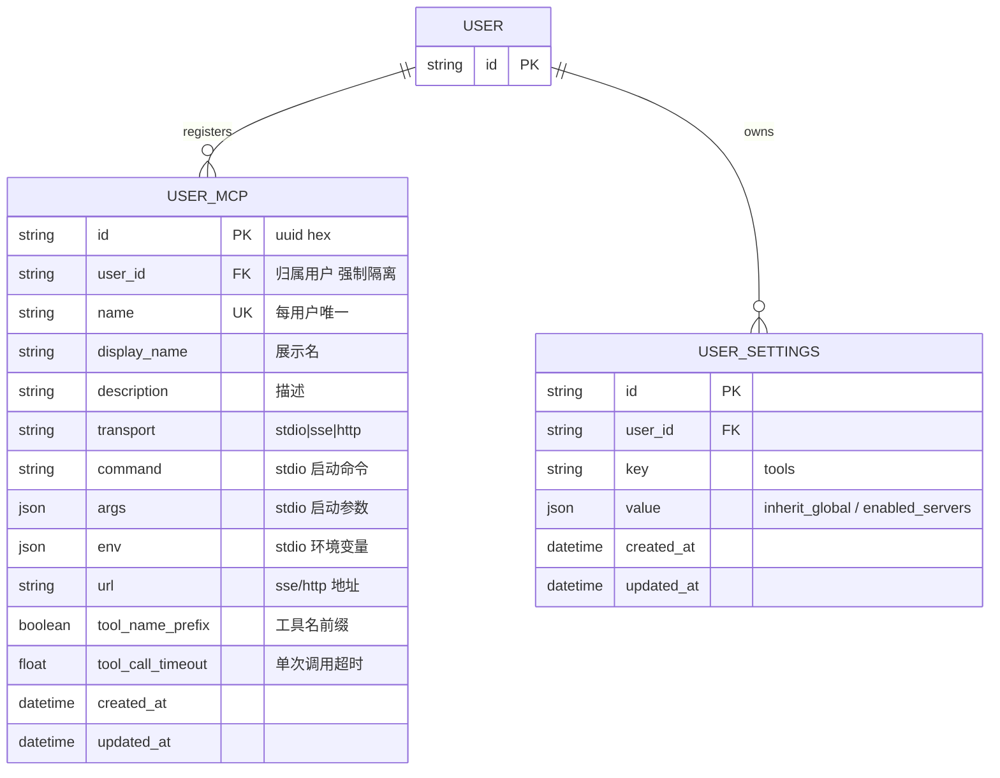

# 用户级 MCP 服务器注册（User MCP Registry）数据库文档

> 粒度：L4 ｜ 版本：1.0 ｜ 日期：2026-08-07

## 1. ER 图

> `USER_SETTINGS` 为既有表；本需求只新增 `USER_MCP`。

## 2. user_mcp 表定义

| 列 | 类型 | 约束 | 说明 |
|----|------|------|------|
| id | VARCHAR(64) | PK | uuid4().hex |
| user_id | VARCHAR(64) | NOT NULL, INDEX | 归属用户（开发无认证模式为 `default`） |
| name | VARCHAR(128) | NOT NULL | 服务器句柄，`^[A-Za-z0-9][A-Za-z0-9._-]{0,127}$` |
| display_name | VARCHAR(255) | NULL | 展示名 |
| description | TEXT | NULL | 人类可读描述 |
| transport | VARCHAR(16) | NOT NULL | `stdio` / `sse` / `http` |
| command | VARCHAR(1024) | NULL | stdio 启动命令 |
| args | JSON | NULL | stdio 启动参数（字符串数组） |
| env | JSON | NULL | stdio 环境变量（键值对，可含密钥） |
| url | VARCHAR(2048) | NULL | sse/http 服务器地址 |
| tool_name_prefix | BOOLEAN | NOT NULL, default TRUE | 工具名是否带服务器名前缀 |
| tool_call_timeout | FLOAT | NULL | 单次工具调用超时（秒） |
| created_at | TIMESTAMP WITH TIME ZONE | NOT NULL | 创建时间 |
| updated_at | TIMESTAMP WITH TIME ZONE | NOT NULL | 更新时间 |

- 唯一约束：`UNIQUE(user_id, name)`（`uq_user_mcp_user_name`）。
- 索引：`ix_user_mcp_user_id`（user_id 单独建索引，支撑 `list_for_user`）。
- schema：`tianshu`（PostgreSQL 下，与 `user_models` 一致；SQLite 下沿用项目既有兼容写法）。
- 迁移文件：`0015_user_mcp.py`，`revision = "0015_user_mcp"`，`down_revision = "0014_workspaces"`；`upgrade` 幂等（`inspector.has_table` 已存在则跳过），`downgrade` 删索引、删表。

## 3. 与既有表的关系

- **运行时工具来源**：`user_mcp`（用户注册集）→ 构建工具 → `filter_mcp_tools` 按 `user_settings.tools` 的 allowlist 过滤。两层数据均按 `user_id` 关联，天然隔离。
- **服务器名一致性**：`user_settings.tools.enabled_servers` 中的名字必须属于该用户自己的 `user_mcp.name`；用户删除服务器后，`settings.tools` 中的残留名字在过滤时自然失效（构建工具集里已无该服务器），无需清理（可接受，避免跨表级联）。

## 4. 数据一致性

- 删除服务器只删 `user_mcp` 行，不影响 `user_settings.tools`（残留名字无害，见上）。
- 写入前校验：`transport` 枚举、`command`/`url` 按 transport 必填、`args`/`env` JSON 结构校验；非法值 400 不落库。
- 与全局配置一致，`env` 中敏感值以脱敏标志形式返回（复用 `_mask_server_config` 思路），明文仅存库。
