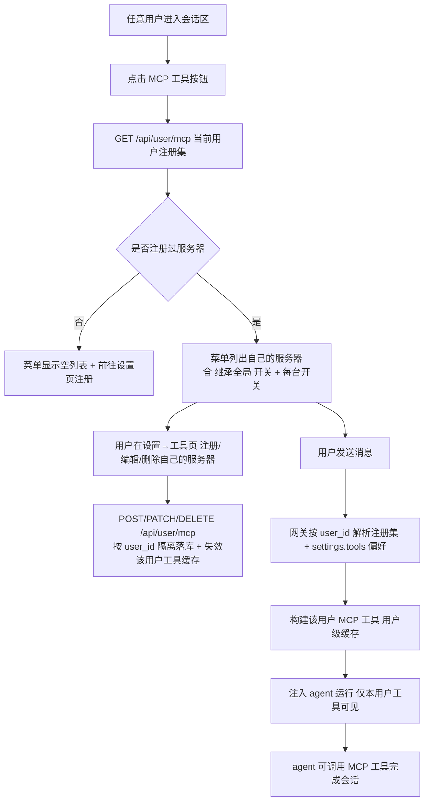

# 用户级 MCP 服务器注册（User MCP Registry）需求文档

> 粒度：L5 ｜ 版本：1.0 ｜ 日期：2026-08-07

## 1. 背景与目标

MCP 是平台级能力，**功能全局通用**——任何用户进入会话区，MCP 工具按钮都可点击。但 **MCP 的具体工具必须用户隔离**——每个用户看到、使用哪些 MCP 服务器的工具，由用户自己决定，彼此不互相污染。

当前实现存在两处与上述原则不符的问题：

| 问题 | 现状 | 后果 |
|------|------|------|
| "继承全局"语义错误 | `settings.tools.inherit_global` 缺省 `true`，运行时解析为 `None`（无限制）→ **所有用户自动获得全部 operator 启用的 MCP 服务器工具** | 用户 A 配置的服务器工具会出现在用户 B 的会话里，反之亦然（跨用户泄漏） |
| 普通用户无注册入口 | MCP 服务器只能由管理员通过 `/api/mcp/config` 写入全局 `extensions_config.json`；该接口对非 admin 返回 403 | 普通用户 MCP 菜单为空，无"自己有的"数据源 |

**目标**：建立「用户级 MCP 服务器注册」子系统——每个用户在设置中注册属于自己的 MCP 服务器（数据存 `user_mcp` 表，按 `user_id` 隔离），会话区 MCP 菜单只显示当前用户自己的注册集，运行时 agent 只加载当前用户自己的服务器工具。"继承全局"开关语义修正为**继承用户自己的全局**（自己注册的全部服务器），与系统全局配置彻底解耦。**全程使用真实数据库数据，禁止 Mock。**

## 2. 范围

### 2.1 纳入本需求

1. **用户级注册表**：PostgreSQL/SQLite `user_mcp` 表（schema: `tianshu`），按 `user_id + name` 存每个用户自己的 MCP 服务器定义（stdio/sse/http）。
2. **CRUD API**：`GET/POST/PATCH/DELETE /api/user/mcp`，读写均以 `get_effective_user_id()` 为边界，无 admin 校验（镜像 `user_models`）。
3. **运行时隔离**：chat/run 处理时按当前用户解析其注册的服务器定义并构建工具（带用户级缓存），注入 agent；**系统全局 `extensions_config.json` 中的 MCP 服务器不再自动注入任何用户会话**。
4. **"继承全局"语义修正**：`settings.tools.inherit_global = true` → 使用该用户自己注册的**全部**服务器；`false` → 仅使用 `enabled_servers` 子集。
5. **前端**：
   - 设置 → 工具页：改为「我的 MCP 服务器」管理（添加/编辑/删除自己的服务器）+ 个性化偏好卡（列表 = 自己的服务器）。
   - 会话区 `MCPToolsMenu`：数据源从全局 `/api/mcp/config` 切换为用户级 `/api/user/mcp`，按钮对所有人可点，菜单只显示自己的服务器。

### 2.2 不在本需求

- **系统全局 MCP 管理面**（`/api/mcp/config` GET/PUT/PATCH + `extensions_config.json`）：接口保留、不再影响运行时注入；作为平台层预留，后续可做"从平台池一键引入到我的服务器"。
- **MCP 协议/连接基础设施**（会话池、路由中间件、工具标签）：复用现有实现，不改动。
- **渠道/集成**：与本需求无关。

## 3. 业务规则

1. **功能全局通用**：会话区 MCP 按钮对所有人可点击；无注册服务器的用户点击后显示空列表（可跳转设置页注册）。
2. **数据用户隔离**：`user_mcp` 全部读写以 `get_effective_user_id()` 为边界；任何接口禁止读取其他用户的注册集。
3. **服务器名唯一**：`UNIQUE(user_id, name)`，同一用户内服务器名不可重复；命名规则 `^[A-Za-z0-9][A-Za-z0-9._-]{0,127}$`。
4. **继承全局 = 用户自己的全局**：`inherit_global: true`（或缺省）→ 使用该用户注册的**全部**服务器工具；`false` → 只使用 `enabled_servers` 名单内的服务器工具（空名单 = 该用户全部禁用）。与系统全局配置无任何关联。
5. **运行时来源唯一**：用户 agent 的 MCP 工具只来自该用户自己的注册集；用户未注册任何服务器 → 该用户无 MCP 工具（与"没有的不显示"一致）。
6. **失败安全**：解析用户 MCP 设置/注册集失败时，不把其他用户或全局的 MCP 工具带进会话；记录日志并降级为"该用户无 MCP 工具"。
7. **缓存失效**：用户 CRUD 自己的服务器后，该用户级别的 MCP 工具缓存立即失效，下次会话生效（不要求重启）。
8. **密钥类数据**：stdio 服务器可填写环境变量（含密钥），存入 `user_mcp.env`（JSON）；API 响应不返回明文敏感值以外的信息（与现有全局 MCP 配置一致，按 `_mask_server_config` 思路处理）。

## 4. 业务流程

## 5. 验收标准

- [ ] 会话区 MCP 按钮对所有用户可点击；菜单只显示当前用户自己注册的服务器。
- [ ] 普通用户可在设置 → 工具页添加/编辑/删除自己的 MCP 服务器（stdio/sse/http 三种传输），数据真实写入 `user_mcp` 表。
- [ ] 用户 A 注册的服务器在用户 B 的菜单与会话中**完全不出现**；B 的亦然。
- [ ] `inherit_global: true` 时该用户自己注册的全部服务器工具可用；`false` 时仅 `enabled_servers` 子集可用；默认（未设置）等于 `inherit_global: true`（自己的全局）。
- [ ] 系统全局 `extensions_config.json` 的 MCP 服务器不再自动注入任何用户会话。
- [ ] 用户修改自己的服务器配置后，无需重启，下一次会话立即按新配置生效（缓存已失效）。
- [ ] 未注册任何服务器的用户：MCP 菜单显示空列表，会话中无 MCP 工具。
- [ ] 迁移 `0015_user_mcp` 幂等可重复执行，PostgreSQL 与 SQLite 均可。
- [ ] 全部使用真实数据（用户操作写入），无 Mock。
