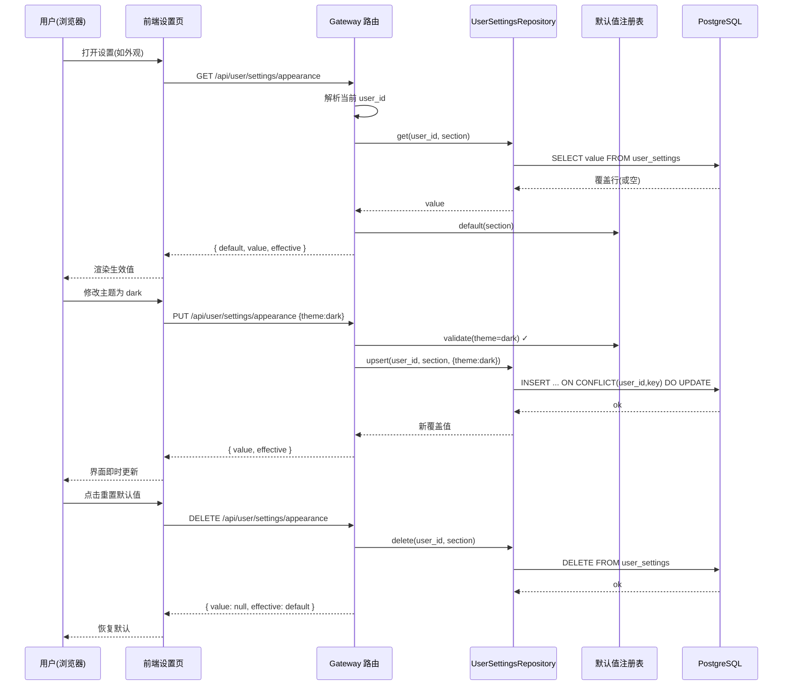

# 用户级设置（User Settings）接口文档

> 粒度：L4 ｜ 版本：1.0 ｜ 日期：2026-08-06

## 1. 通用约定

- 前缀：`/api/user/settings`
- 用户边界：全部端点使用请求上下文 `get_effective_user_id()` 解析当前用户；无认证开发模式回退 `default`。
- 内容类型：`application/json`；错误统一 `{"detail": "..."}`。
- 区块键白名单：`appearance` | `notification` | `channels` | `integrations` | `tools`，未知键返回 404。

## 2. 端点

### GET `/api/user/settings`

返回全部区块的默认值、用户覆盖值与生效值。

```json
{
  "defaults": { "appearance": { "theme": "system", "locale": "en-US" }, "notification": { "enabled": true } },
  "values": { "appearance": { "theme": "dark" } },
  "effective": { "appearance": { "theme": "dark", "locale": "en-US" }, "notification": { "enabled": true } }
}
```

### GET `/api/user/settings/{section}`

```json
{ "section": "appearance", "default": { "theme": "system", "locale": "en-US" }, "value": { "theme": "dark" }, "effective": { "theme": "dark", "locale": "en-US" } }
```

### PUT `/api/user/settings/{section}`

请求体为区块值的**部分覆盖**（与既有覆盖 deep-merge）：

```json
{ "theme": "dark" }
```

校验失败示例（400）：

```json
{ "detail": "appearance.theme: 非法值 'neon'，允许: system|light|dark" }
```

响应（200）：与 GET 单区块同构。`value` 为合并后的覆盖值（`null` 表示用户主动清除该字段时回退默认）。

### DELETE `/api/user/settings/{section}`

删除覆盖行，重置为默认值。响应（200）：

```json
{ "section": "appearance", "default": { "theme": "system", "locale": "en-US" }, "value": null, "effective": { "theme": "system", "locale": "en-US" } }
```

## 3. 调用时序



## 4. 校验规则

| section | 字段 | 规则 |
|---------|------|------|
| appearance | theme | 枚举 system/light/dark |
| appearance | locale | 枚举 en-US/zh-CN |
| notification | enabled | 布尔 |
| channels / integrations / tools | inherit_global | 布尔 |
| channels | enabled_channels | string[]（去重） |
| integrations | enabled_integrations | string[]（去重） |
| tools | enabled_servers | string[]（去重） |
