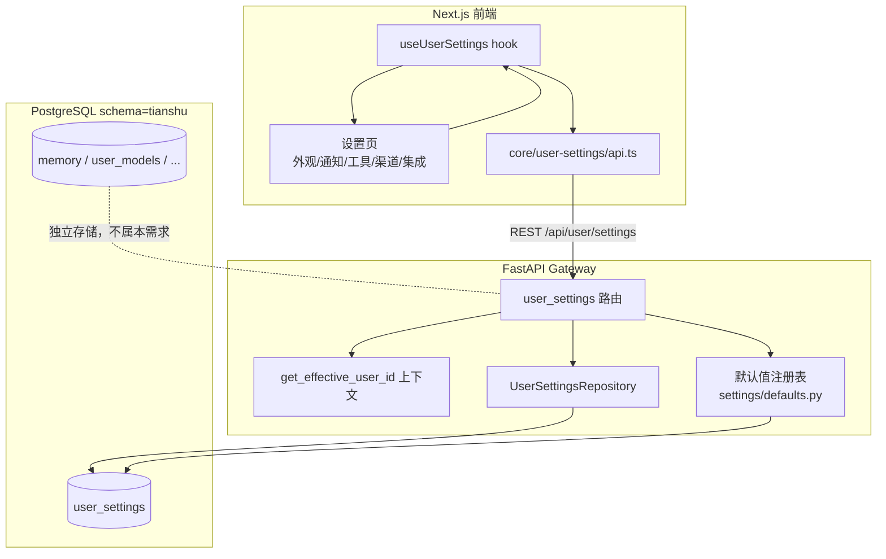

# 用户级设置（User Settings）系统架构文档

> 粒度：L4 ｜ 版本：1.0 ｜ 日期：2026-08-06

## 1. 架构总览

## 2. 模块划分

| 模块 | 路径 | 职责 |
|------|------|------|
| 默认值注册表 | `tianshu/settings/defaults.py` | 各 section 默认值 + 校验/归一化函数 |
| ORM 模型 | `tianshu/persistence/user_settings/model.py` | `UserSettingsRow` |
| 仓储 | `tianshu/persistence/user_settings/sql.py` | 异步 CRUD（list/get/upsert/delete） |
| 迁移 | `tianshu/persistence/migrations/versions/0013_user_settings.py` | 建表（幂等） |
| 路由 | `app/gateway/routers/user_settings.py` | REST 端点，用户边界 |
| 前端 API | `frontend/src/core/user-settings/api.ts` | fetch 封装 |
| 前端 hooks | `frontend/src/core/user-settings/hooks.ts` | TanStack Query 查询/变更 |

## 3. 数据流

1. 前端进入设置页 → `useUserSettings` 发起 `GET /api/user/settings`。
2. 路由通过 `get_effective_user_id()` 解析当前用户（无认证开发模式回退 `default`）。
3. 仓储读取该用户 `user_settings` 覆盖行；路由与默认值注册表合并得到 `effective`。
4. 用户修改 → `PUT /api/user/settings/{section}` → 校验 → 合并覆盖 → 落库 → 返回新 `effective`。
5. 重置 → `DELETE` → 删除覆盖行 → 返回默认 `effective`。

## 4. 关键设计决策

- **通用表 + JSONB**：一个 `user_settings` 表承载所有区块，schema-less 便于扩展；区块校验收敛在默认值注册表。
- **默认值注册表即单一事实**：前端展示的「默认值」来自后端，不硬编码在前端。
- **写入即返回生效值**：PUT/DELETE 返回合并后的 `effective`，前端直接用响应更新本地状态，避免二次请求。
- **异步仓储**：沿用 `user_models` 的 `AsyncSession` 模式，与 FastAPI 异步端点匹配。
- **记忆保持独立表**：用户明确要求，memory 已是独立按用户存储，不并入 `user_settings`。
