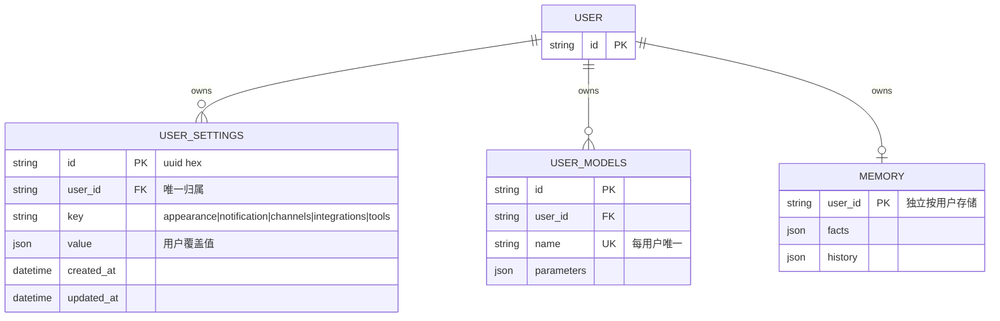

# 用户级设置（User Settings）数据库文档

> 粒度：L4 ｜ 版本：1.0 ｜ 日期：2026-08-06

## 1. ER 图



> `USER_MODELS` 与 `MEMORY` 为既有表，仅作参照；本需求只新增 `USER_SETTINGS`。

## 2. user_settings 表定义

| 列 | 类型 | 约束 | 说明 |
|----|------|------|------|
| id | VARCHAR(64) | PK | uuid4().hex |
| user_id | VARCHAR(64) | NOT NULL, INDEX | 归属用户（开发无认证模式为 `default`） |
| key | VARCHAR(64) | NOT NULL | 设置区块键 |
| value | JSON | NOT NULL | 用户覆盖值（JSON 对象） |
| created_at | TIMESTAMP WITH TIME ZONE | NOT NULL | 创建时间 |
| updated_at | TIMESTAMP WITH TIME ZONE | NOT NULL | 更新时间 |

- 唯一约束：`UNIQUE(user_id, key)`（`uq_user_settings_user_key`）。
- schema：`tianshu`（PostgreSQL 下，与 `user_models` 一致，兼容 psycopg 预编译语句）。
- 迁移文件：`0013_user_settings.py`，`upgrade` 幂等（已存在则跳过），SQLite 亦可用。

## 3. 默认值注册表（代码内，非表数据）

```python
DEFAULT_USER_SETTINGS = {
    "appearance": {"theme": "system", "locale": "en-US"},
    "notification": {"enabled": True},
    "channels": {"inherit_global": True, "enabled_channels": []},
    "integrations": {"inherit_global": True, "enabled_integrations": []},
    "tools": {"inherit_global": True, "enabled_servers": []},
}
```

## 4. 数据一致性

- 覆盖行仅在用户修改时创建；未修改的区块无行 → `effective == default`。
- `DELETE` 只删除覆盖行，不删用户。
- JSON 值写入前经校验器归一化（去重、白名单取值），非法值直接 400，不落库。
