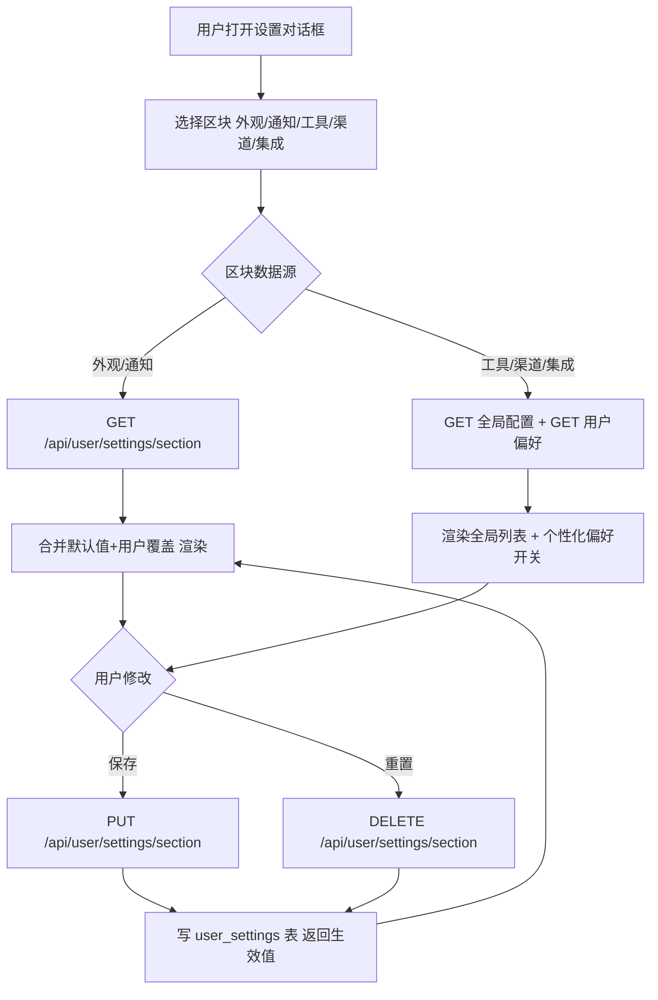

# 用户级设置（User Settings）需求文档

> 粒度：L5 ｜ 版本：1.0 ｜ 日期：2026-08-06

## 1. 背景与目标

当前「设置」中各类配置的存储不一致：

| 设置项 | 现状 | 问题 |
|--------|------|------|
| 外观（主题/语言） | 浏览器 localStorage + cookie | 换设备丢失；不同用户共用同一浏览器时互相污染 |
| 通知 | 浏览器 localStorage | 同上 |
| 记忆 | PostgreSQL 独立存储，已按 `user_id` 隔离 | 无问题，保持 |
| 技能 | 按用户技能存储（`get_effective_user_id`） | 无问题，保持 |
| 渠道 / 集成 / 工具(MCP) | 管理员级全局资源 | 无「千人千面」个性化能力 |

**目标**：建立「用户级设置」子系统 —— 设置项从当前用户的数据库记录读取，每个用户拥有独立的配置（千人千面）；提供服务端默认值注册表与「默认值 ∪ 用户覆盖 = 生效值」的合并机制，支持用户修改默认值（覆盖）与重置回默认值。**全程使用真实数据库数据，禁止 Mock。**

## 2. 范围

### 2.1 纳入本需求

1. **通用存储**：PostgreSQL `user_settings` 表（schema: `tianshu`），按 `user_id + key` 存储各设置区块的用户覆盖。
2. **默认值注册表**：服务端定义各区块默认值（`appearance` / `notification` / `channels` / `integrations` / `tools`）。
3. **API**：`GET/PUT/DELETE /api/user/settings[/{section}]`，读写均以当前用户（`get_effective_user_id()`）为边界。
4. **前端迁移**：
   - 外观、通知页：从 localStorage 改为读写用户库；
   - 工具、渠道、集成页：新增「我的个性化偏好」区（默认继承全局配置，用户可覆盖）；
   - 工具页：新增「添加 MCP 服务器」管理入口（管理员），支持通过表单添加（stdio/sse/http）与删除 MCP 服务器，配置写入 `extensions_config.json`（`PUT /api/mcp/config`）。

### 2.2 不在本需求

- **记忆、技能**：已是按用户隔离的独立存储，本需求不改变其存储（记忆保持独立表）。
- **渠道/集成/工具的基础设施本身**：仍由管理员全局管理（OAuth 凭证、MCP 内部网络连接、渠道连接）；本需求只做用户级偏好层，不重构运行时。

## 3. 业务规则

1. **生效值合并**：`effective(section) = deep_merge(default(section), user_override(section))`。
2. **默认继承全局**：`channels/integrations/tools` 区块默认 `inherit_global=true`（完全跟随全局配置）；用户关闭后按自己勾选的启用列表生效。
3. **校验**：每个区块有类型/取值约束，非法输入返回 400 + 明确 detail。
4. **重置**：`DELETE` 删除用户覆盖行，恢复默认值。
5. **隔离**：所有读写都以请求上下文中的有效用户 ID 为边界，禁止跨用户读写。
6. **密钥类数据**：本需求不存储任何密钥；工具/渠道/集成的凭证仍由全局管理员配置持有。
7. **偏好卡片显示规则**：渠道/工具页的「个性化偏好」区仅在存在可用项（有渠道 provider / 有 MCP 服务器）时显示；无可选项时隐藏，避免空卡片插在页面中间。

## 4. 业务流程

## 5. 验收标准

- [ ] 外观、通知页的数据来自用户库；修改后刷新/换浏览器仍生效（千人千面）。
- [ ] 工具/渠道/集成页显示「个性化偏好」区，默认继承全局；关闭继承后可勾选启用项。
- [ ] 渠道/工具页无可用项时隐藏「个性化偏好」区，不显示空卡片。
- [ ] 工具页（管理员）可添加/删除 MCP 服务器，配置真实写入 `extensions_config.json`。
- [ ] 提供重置回默认值操作。
- [ ] 非法输入（如非法 theme / locale / 非布尔值）返回 400 且不落库。
- [ ] 迁移 0013 可重复执行（幂等），PostgreSQL 与 SQLite 均可。
- [ ] 全部使用真实数据（种子/用户操作写入），无 Mock。
