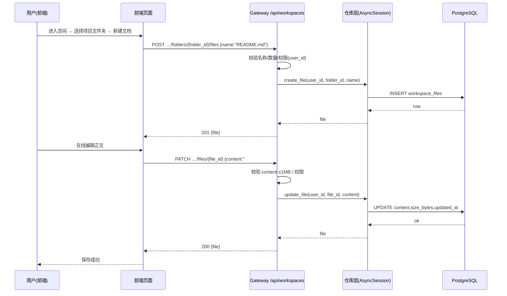
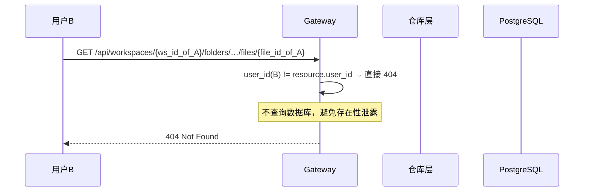
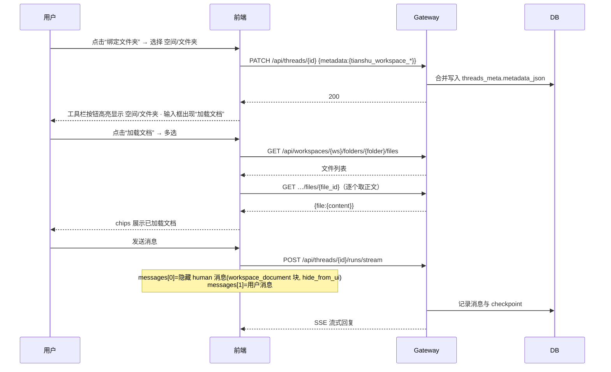

# 工作空间（个人空间）接口设计

- 版本：v1.1
- 级别：L4
- 日期：2026-08-06

## 1. 概述

REST API，前缀 `/api/workspaces`。所有端点经 AuthMiddleware 鉴权；用户身份统一来自 `get_effective_user_id()`（开发无认证模式回退 `default`）。所有资源严格按属主隔离，越权访问一律 **404**。

## 2. 数据模型（响应）

### 2.1 Workspace

```json
{
  "id": "hex64",
  "name": "我的工作空间",
  "description": null,
  "is_default": true,
  "folder_count": 2,
  "file_count": 5,
  "created_at": "2026-08-06T08:00:00Z",
  "updated_at": "2026-08-06T08:00:00Z"
}
```

### 2.2 Folder

```json
{
  "id": "hex64",
  "workspace_id": "hex64",
  "name": "项目A",
  "sort_order": 0,
  "file_count": 3,
  "created_at": "…",
  "updated_at": "…"
}
```

### 2.3 File（列表项不含 content，详情含）

```json
{
  "id": "hex64",
  "folder_id": "hex64",
  "workspace_id": "hex64",
  "name": "README.md",
  "extension": "md",
  "mime_type": "text/markdown",
  "size_bytes": 1234,
  "storage_status": "embedded",
  "content": "# 标题",         // 仅详情返回
  "created_at": "…",
  "updated_at": "…"
}
```

## 3. 端点规范

### 3.1 空间

| 方法 | 路径 | 说明 |
|------|------|------|
| GET | `/api/workspaces` | 我的空间列表（含 folder_count/file_count，按 created_at 升序） |
| POST | `/api/workspaces` | 创建空间（body: name, description?）；首个空间自动 is_default |
| GET | `/api/workspaces/{ws_id}` | 空间详情（含 folders 数组） |
| PATCH | `/api/workspaces/{ws_id}` | 更新 name/description；若为默认空间被改名不影响默认位 |
| DELETE | `/api/workspaces/{ws_id}` | 删除空间（级联文件夹+文件）；若删除的是默认空间，自动转正最早创建的剩余空间 |

### 3.2 文件夹

| 方法 | 路径 | 说明 |
|------|------|------|
| POST | `/api/workspaces/{ws_id}/folders` | 创建项目文件夹（body: name）；sort_order = 当前最大+1 |
| PATCH | `/api/workspaces/{ws_id}/folders/{folder_id}` | 重命名/排序（body: name?, sort_order?） |
| DELETE | `/api/workspaces/{ws_id}/folders/{folder_id}` | 删除文件夹（级联文件） |

### 3.3 文档

| 方法 | 路径 | 说明 |
|------|------|------|
| GET | `/api/workspaces/{ws_id}/folders/{folder_id}/files` | 文件夹内文档列表（不含 content） |
| POST | `/api/workspaces/{ws_id}/folders/{folder_id}/files` | 新建文档（body: name, content?=""); 自动推断 extension/mime |
| GET | `/api/workspaces/{ws_id}/folders/{folder_id}/files/{file_id}` | 文档详情（含 content） |
| PATCH | `/api/workspaces/{ws_id}/folders/{folder_id}/files/{file_id}` | 更新 name/content（body: name?, content?） |
| DELETE | `/api/workspaces/{ws_id}/folders/{folder_id}/files/{file_id}` | 删除文档 |

## 4. 校验规则

| 项 | 规则 | 错误 |
|----|------|------|
| 空间名称 | 1~100 字符，trim 后非空 | 400 |
| 空间重名 | 同用户下唯一（case-insensitive） | 409 |
| 空间数量 | ≤ 50/用户 | 413 |
| 文件夹名称 | 1~100 字符，trim 后非空；同空间唯一 | 400 / 409 |
| 文件夹数量 | ≤ 500/空间 | 413 |
| 文档名称 | 1~255 字符；同文件夹唯一 | 400 / 409 |
| 文档数量 | ≤ 2000/文件夹 | 413 |
| content | Markdown 文本 ≤ 1MB | 413 |
| 未知空间/文件夹/文档 id | 一律 404（不区分是否属于当前用户） | 404 |
| 请求体 JSON 非法 | 422（FastAPI 默认） | 422 |

## 5. 调用时序

### 5.1 新建文档并编辑保存



### 5.2 越权访问被拒绝



## 6. 错误响应格式

与现有网关一致：`{"detail": "描述"}`；业务错误统一 HTTPException(status_code, detail)。客户端依据 status 展示 i18n 提示。

## 7. 会话绑定与文档加载（v1.1 增量）——复用端点，无新增 REST API

| 能力 | 复用端点 | 说明 |
|------|----------|------|
| 绑定/解除绑定 | `PATCH /api/threads/{thread_id}` | body `{"metadata": {tianshu_workspace_id, tianshu_workspace_folder_id, tianshu_workspace_name, tianshu_workspace_folder_name}}`；解除绑定传 `null` 清空四键 |
| 列出绑定文件夹文档 | `GET /api/workspaces/{ws_id}/folders/{folder_id}/files` | 前端通过绑定 metadata 反查 |
| 读取文档正文 | `GET /api/workspaces/{ws_id}/folders/{folder_id}/files/{file_id}` | 返回含 `content`，用于构造隐藏注入消息 |
| 发送注入 | `POST /api/threads/{thread_id}/runs/stream` | `input.messages` 首条为隐藏 human 消息（`additional_kwargs.hide_from_ui: true`，content 含 `<workspace_document name="...">正文</workspace_document>` 块） |

### 7.1 时序（绑定 + 加载 + 发送）


