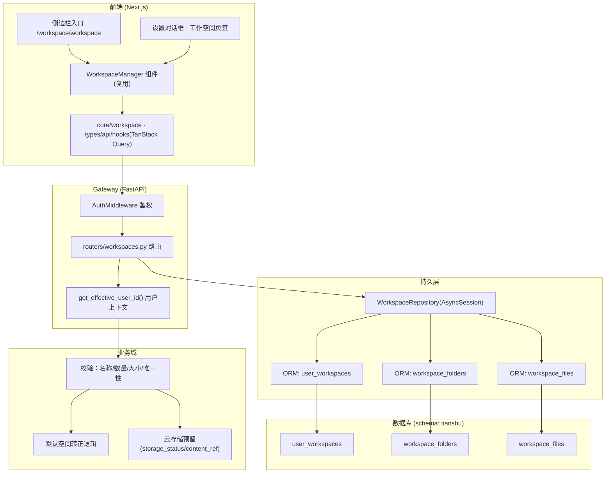
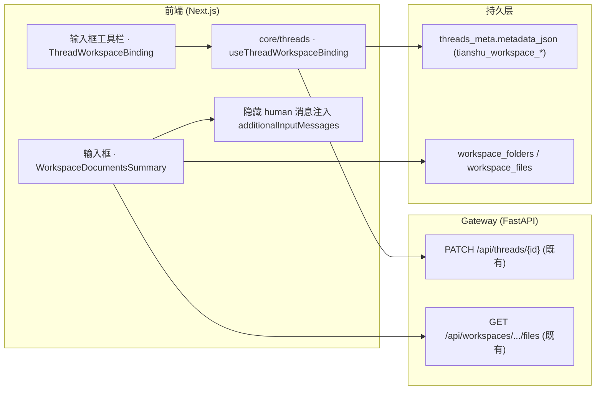

# 工作空间（个人空间）系统架构

- 版本：v1.1
- 级别：L4
- 日期：2026-08-06

## 1. 架构定位

工作空间模块为 **用户数据面** 的新增能力，沿用现有分层：前端（Next.js App Router + TanStack Query）→ Gateway（FastAPI 路由）→ 仓库层（AsyncSession）→ PostgreSQL/SQLite。与 `user_settings`、`user_models`、`memory` 同构，按用户隔离。

## 2. 系统架构图

## 3. 模块职责

| 层 | 组件 | 职责 |
|----|------|------|
| 前端 | WorkspaceManager | 空间/文件夹/文档三级导航 + 文档编辑；与设置页签共享同一组件 |
| 前端 | core/workspace | API 客户端、类型、TanStack Query hooks（乐观更新 + 失效） |
| 网关 | routers/workspaces.py | REST 端点、请求校验、错误映射 |
| 业务域 | 校验层 | 名称/数量/正文大小/唯一性规则（与需求文档一致） |
| 持久层 | WorkspaceRepository | AsyncSession CRUD，所有查询附加 `user_id` 过滤 |
| 持久层 | ORM | 3 张表，级联删除（delete-orphan） |

## 4. 关键设计决策

1. **两层隔离**：`workspace_folders` / `workspace_files` 冗余 `user_id`，仓库层每条 SQL 都带属主条件，防 IDOR 双保险；
2. **级联删除**：ORM 关系 `cascade="all, delete-orphan"`，删除空间/文件夹在单事务内完成；
3. **内容策略**：文档正文（≤1MB）存 `content` TEXT；`storage_status='embedded'|'cloud'` + `content_ref` 预留云存储，二进制内容本期不入库；
4. **前端复用**：设置页签与侧边栏入口渲染同一 `WorkspaceManager`，避免两套实现漂移；
5. **无 Mock**：后端与前端全部走真实数据库，验证用种子数据 + 真实 CRUD。

## 5. 部署与配置

- 新增迁移 `0014_workspaces` 随启动自动执行（Alembic upgrade）；
- 无需新增环境变量/配置项；复用现有数据库连接与上传目录基础设施；
- 云存储接入点已预留（storage_status/content_ref），未来实现时替换写入路径即可。

## 6. 会话绑定与文档加载（v1.1 增量）

### 6.1 架构要点

- **零后端变更**：绑定存储在 thread metadata（`threads_meta.metadata_json` 的 `tianshu_workspace_*` 键），复用 `PATCH /api/threads/{id}` 写入；文档加载复用现有 `GET /api/workspaces/.../files` 与文件详情接口。
- **前端注入链路**：输入框底部工具栏的 `ThreadWorkspaceBinding`（绑定，与文件选择/工作流/录音/润色并列）→ `useThreadWorkspaceBinding`（PATCH metadata）→ 输入框 `WorkspaceDocumentsSummary`（加载文档）→ 发送时构造隐藏 human 消息注入 `additionalInputMessages`（复用 sidecar quote 的隐藏消息范式）。

### 6.2 架构图（增量）

### 6.3 关键设计决策

1. **绑定存 metadata 而非新表**：thread 绑定是会话级轻量关系，metadata 开放 JSON 足够；列表显示用冗余名称避免 join；
2. **隐藏消息注入**：文档正文以 `hide_from_ui` 隐藏 human 消息进入消息流，持续在 state 中对 Agent 可见，但不污染 UI 历史；
3. **前端职责**：绑定/加载均为前端组合既有 API，隔离语义（user_id）由后端 workspaces/threads API 保证，前端不引入新的可信边界。
