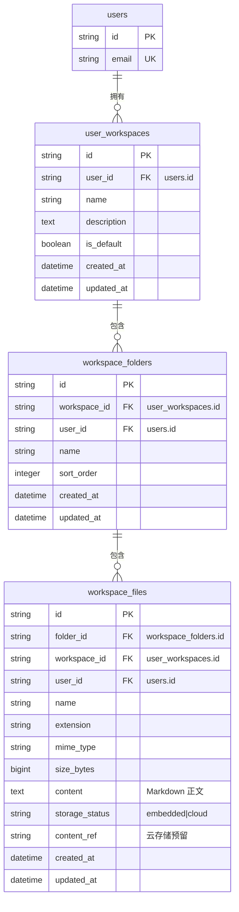

# 工作空间（个人空间）数据库设计

- 版本：v1.1
- 级别：L4
- 日期：2026-08-06

## 1. 概述

新增 3 张表，全部归属应用 schema `tianshu`（Postgres）/默认 schema（SQLite），与 `user_settings`、`user_models` 同源。**只存元数据与文档正文，不存二进制内容**；`storage_status` / `content_ref` 为后期云存储预留。

> **v1.1 增量**：会话 ↔ 文件夹绑定**不新增表**，直接复用既有 `threads_meta.metadata_json` 开放字典，写入 `tianshu_workspace_id` / `tianshu_workspace_folder_id` / `tianshu_workspace_name` / `tianshu_workspace_folder_name` 四个键（前缀 `tianshu_` 与既有 `tianshu_pinned` 等键一致，避免与客户端键冲突）。

## 2. ER 图

## 3. 表定义

### 3.1 tianshu.user_workspaces（个人空间）

| 字段 | 类型 | 约束 | 说明 |
|------|------|------|------|
| id | String(64) | PK | uuid4().hex |
| user_id | String(64) | NOT NULL, INDEX | 属主用户（users.id） |
| name | String(100) | NOT NULL | 空间名称 |
| description | Text | NULL | 空间描述 |
| is_default | Boolean | NOT NULL, default false | 默认空间标记 |
| created_at | DateTime(tz) | NOT NULL | 创建时间 |
| updated_at | DateTime(tz) | NOT NULL | 更新时间 |

- 唯一约束：`uq_user_workspaces_user_name (user_id, name)`
- 索引：`ix_user_workspaces_user_id (user_id)`

### 3.2 tianshu.workspace_folders（项目文件夹）

| 字段 | 类型 | 约束 | 说明 |
|------|------|------|------|
| id | String(64) | PK | uuid4().hex |
| workspace_id | String(64) | NOT NULL, FK→user_workspaces.id ON DELETE CASCADE, INDEX | 所属空间 |
| user_id | String(64) | NOT NULL, INDEX | 冗余属主，用于隔离查询 |
| name | String(100) | NOT NULL | 文件夹名称（=项目名） |
| sort_order | Integer | NOT NULL, default 0 | 排序 |
| created_at | DateTime(tz) | NOT NULL | |
| updated_at | DateTime(tz) | NOT NULL | |

- 唯一约束：`uq_workspace_folders_ws_name (workspace_id, name)`
- 索引：`ix_workspace_folders_ws_id (workspace_id)`、`ix_workspace_folders_user_id (user_id)`

### 3.3 tianshu.workspace_files（文档/文件记录）

| 字段 | 类型 | 约束 | 说明 |
|------|------|------|------|
| id | String(64) | PK | uuid4().hex |
| folder_id | String(64) | NOT NULL, FK→workspace_folders.id ON DELETE CASCADE, INDEX | 所属文件夹 |
| workspace_id | String(64) | NOT NULL, FK→user_workspaces.id ON DELETE CASCADE, INDEX | 冗余，级联删除兜底 |
| user_id | String(64) | NOT NULL, INDEX | 冗余属主 |
| name | String(255) | NOT NULL | 文档名称（含扩展名） |
| extension | String(20) | NULL | 扩展名（如 md） |
| mime_type | String(120) | NULL | MIME 类型（预留） |
| size_bytes | BigInteger | NOT NULL, default 0 | 字节数 |
| content | Text | NULL | Markdown 正文（仅文档类型） |
| storage_status | String(20) | NOT NULL, default 'embedded' | embedded=正文入库；cloud=预留云存储 |
| content_ref | String(512) | NULL | 云存储对象引用（预留） |
| created_at | DateTime(tz) | NOT NULL | |
| updated_at | DateTime(tz) | NOT NULL | |

- 唯一约束：`uq_workspace_files_folder_name (folder_id, name)`
- 索引：`ix_workspace_files_folder_id (folder_id)`、`ix_workspace_files_user_id (user_id)`

## 4. 一致性说明

- `workspace_id` / `user_id` 在 `workspace_folders` 与 `workspace_files` 上冗余存储：删除空间时 ORM 通过 `user_workspaces` 关系级联；隔离查询时按 `user_id` 单表过滤，避免跨表 JOIN 泄露；
- 仓库层**所有读取/写入都附加 `user_id == 当前用户` 条件**，即使绕过路由也无法访问他人数据；
- 删除操作依赖 ORM `cascade="all, delete-orphan"`：删空间 → 删文件夹 → 删文件，事务内一次提交。

## 5. 迁移

Alembic 迁移 `0014_workspaces`（down_revision=`0013_user_settings`），幂等模式与 0013 一致（表已存在则跳过）。SQLite/Postgres 通用，无服务端默认值。
