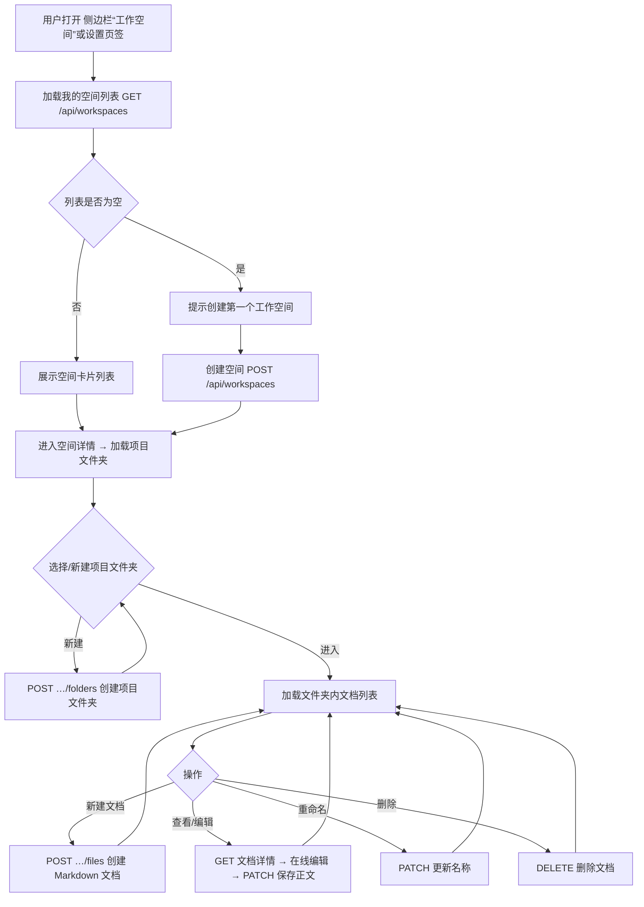

# 工作空间（个人空间）需求文档

- 版本：v1.0
- 级别：L5（需求）
- 日期：2026-08-06

## 1. 背景与目标

当前用户产生的文档、图片散落在会话/聊天上下文中，无法按项目长期整理。本需求为**每个用户**提供独立的**工作空间（个人空间）**：

1. 用户产生的文档、图片等统一收纳在个人空间的自定义文件夹中；
2. 按用户的不同**项目**进行隔离（一个顶层文件夹 = 一个项目）；
3. 实现个人空间管理、空间下文件夹管理、文件夹内文档管理；
4. 支持**手动新建 Markdown 文档 + 在线编辑**；
5. **只存元数据与文档正文，不存二进制内容**，为后期接入文件存储云预留抽象；
6. 全程使用数据库真实数据，禁止 Mock。

## 2. 范围

### 2.1 功能范围

| 模块 | 能力 |
|------|------|
| 个人空间管理 | 创建 / 重命名 / 删除 / 查看个人空间；首个空间自动设为默认 |
| 文件夹管理 | 在空间下创建 / 重命名 / 删除项目文件夹；文件夹即项目，按文件夹隔离 |
| 文档管理 | 在文件夹下新建 / 重命名 / 查看 / 在线编辑 / 删除 Markdown 文档 |
| 入口 | 侧边栏独立入口（`/workspace/workspace`）+ 设置对话框新增“工作空间”页签 |
| 隔离 | 所有数据严格按当前用户隔离（`user_id` 恒来自请求上下文） |

### 2.2 非功能范围

- 只存文档正文（TEXT）与元数据；**二进制/大文件内容不入库**，`storage_status`/`content_ref` 为云存储预留；
- 文档正文上限 1MB，名称长度、空间/文件夹/文件数量均有硬上限；
- 删除空间/文件夹为**级联删除**其下子项；
- 无 Mock 数据，验证使用数据库种子/真实 CRUD。

### 2.3 明确不做（本期）

- 上传/存储图片与二进制文件内容（仅预留云存储字段）；
- 聊天 artifacts 自动归档到工作空间；
- 文件夹多级嵌套（保持“空间 → 项目文件夹 → 文档”两层）；
- 空间共享/协作、权限角色（仅本人可见）。

## 3. 业务规则

### 3.1 空间规则

- 每用户最多 **50** 个空间；
- 空间名称 1~100 字符，去首尾空白后不得为空；同用户下名称唯一（大小写不敏感处理）；
- 用户的**首个**空间自动标记 `is_default`；删除默认空间时，若仍存在其它空间，则将创建最早的剩余空间设为默认；
- 删除空间级联删除其全部文件夹与文档。

### 3.2 文件夹规则

- 每空间最多 **500** 个文件夹；
- 文件夹名称 1~100 字符，同一空间下唯一；
- 文件夹即“项目”，用于按项目隔离文档；
- 删除文件夹级联删除其下全部文档。

### 3.3 文档规则

- 每文件夹最多 **2000** 个文档；
- 文档名称 1~255 字符，同一文件夹下唯一；扩展名自动从名称提取（如 `.md`）；
- 文档正文（Markdown）上限 **1MB**；正文为空视为新建时的初始状态；
- 在线编辑仅支持 Markdown 文本；二进制内容本期不支持写入。

### 3.4 隔离与权限规则

- 空间/文件夹/文件必须属于当前用户（`user_id == get_effective_user_id()`），否则一律返回 **404**（不泄露存在性）；
- 所有写操作遵循现有网关权限模型（AuthMiddleware + 路由级鉴权）。

## 4. 业务流程



## 5. 验收标准

| 编号 | 验收项 |
|------|--------|
| AC-1 | 空账号：无空间时显示引导文案，可创建首个空间且自动为默认空间 |
| AC-2 | 用户 A 创建的空间/文件夹/文档，用户 B 无法通过任何 API 读取或修改（返回 404） |
| AC-3 | 空间内可创建多个项目文件夹；文件夹内可新建、编辑、重命名、删除 Markdown 文档 |
| AC-4 | 文档编辑保存后重新加载，内容与保存时一致（真实数据库持久化） |
| AC-5 | 删除空间后其下文件夹与文档全部消失（级联） |
| AC-6 | 名称唯一性、长度限制、数量上限、正文 1MB 上限均返回明确 400/413 错误 |
| AC-7 | 侧边栏入口与设置页签均可进入并使用同一套功能 |
| AC-8 | 全程无 Mock 数据；验证基于数据库真实读写 |

## 6. 会话 ↔ 工作空间文件夹绑定与文档加载（v1.1 增量）

### 6.1 背景与目标

为让会话产生的文档可归档到具体项目文件夹，并让会话可读取项目文档作为上下文，新增：

1. **会话绑定文件夹**：会话在输入框底部工具栏可绑定一个工作空间文件夹（空间 → 项目文件夹两级选择），表示该会话归档于哪个项目；
2. **侧栏归档标识**：会话列表（最近对话）为已绑定会话显示文件夹徽标；
3. **会话加载文档**：已绑定文件夹的会话可从该文件夹选择文档加载为上下文，随下一条用户消息作为隐藏参考材料发送给 Agent。

### 6.2 功能范围

| 能力 | 说明 |
|------|------|
| 绑定选择器 | 输入框底部工具栏新增“绑定文件夹”按钮（与文件选择/工作流/录音/润色并列；已绑定图标高亮），Dialog 内两级选择（工作空间 → 项目文件夹），可解除绑定 |
| 绑定持久化 | 绑定写入 **thread metadata**（`tianshu_workspace_*` 四键），复用 `PATCH /api/threads/{id}`，**无新表、无新后端路由** |
| 侧栏徽标 | `RecentChatList` 对已绑定会话显示文件夹名徽标（读 metadata） |
| 加载文档 | 输入框上方（已绑定时）出现“加载文档”按钮 → Dialog 列出绑定文件夹内文档（多选）→ 加载后显示可移除 chips，随下一条消息以隐藏 human 消息（`hide_from_ui`）注入 `additionalInputMessages` |
| 绑定隔离 | 绑定/加载全部走用户现有工作空间 API（`user_id` 隔离），跨用户文件夹不可见 |

### 6.3 业务规则

- 绑定仅允许选择**当前用户自己的**空间与文件夹；解除绑定即清空四个 metadata 键；
- 未绑定文件夹的会话不显示“加载文档”入口；
- 加载的文档正文上限遵循工作空间 API 的 1MB 限制；隐藏消息不渲染进 UI 历史（`hide_from_ui: true`），发送成功后自动清空已加载 chips；
- 会话列表徽标读取 metadata 冗余名称；若文件夹被重命名，名称在下次重新绑定时刷新（显示缓存语义）。

### 6.4 业务流程

```mermaid
flowchart TD
    A[会话输入框工具栏 点击 绑定文件夹] --> B[Dialog 选择工作空间]
    B --> C[Dialog 选择项目文件夹]
    C --> D[PATCH /api/threads/{id} 写入 tianshu_workspace_* metadata]
    D --> E[按钮显示 空间/文件夹 · 侧栏显示文件夹徽标]
    E --> F[输入框上方出现 加载文档 入口]
    F --> G[选择绑定文件夹内文档 多选]
    G --> H[loadFile 读取正文 → chips 展示]
    H --> I[用户发送下一条消息]
    I --> J[构造隐藏 human 消息 content 含 workspace_document 块]
    J --> K[thread.submit additionalInputMessages 注入]
    K --> L[Agent 以文档为参考回复 · chips 清空]
```

### 6.5 验收标准（增量）

| 编号 | 验收项 |
|------|--------|
| AC-B1 | 新建会话发送消息后，输入框底部工具栏出现“绑定文件夹”按钮；绑定后按钮高亮（Tooltip 显示“空间 / 文件夹”），刷新后仍保留 |
| AC-B2 | 绑定请求为 `PATCH /api/threads/{id}`，body 含 `tianshu_workspace_id/folder_id/name/folder_name` 四键；解除绑定后四键清空 |
| AC-B3 | 侧栏最近对话中已绑定会话显示文件夹徽标（图标 + 文件夹名） |
| AC-B4 | 已绑定会话输入框上方出现“加载文档”；Dialog 仅列出绑定文件夹内的文档 |
| AC-B5 | 加载文档后出现可移除 chips；发送消息时请求体含隐藏 human 消息（`hide_from_ui`，`<workspace_document name="...">正文</workspace_document>`），发送成功后 chips 自动清空 |
| AC-B6 | 未绑定会话不显示“加载文档”入口；无 i18n key 泄漏，控制台无运行时错误 |

